# None


!! Error: Name is missing

## Mermaid Class Diagram

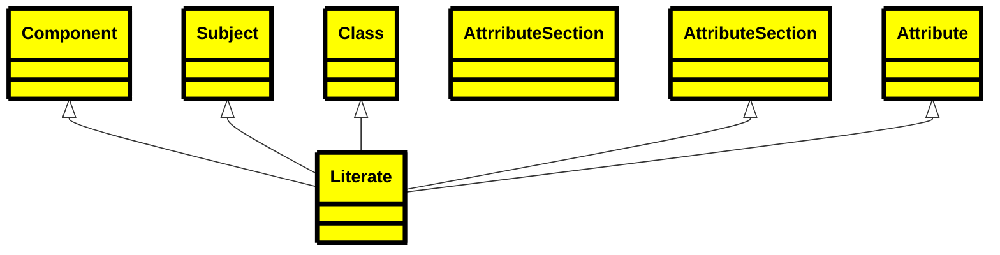

## Mermaid Flowchart

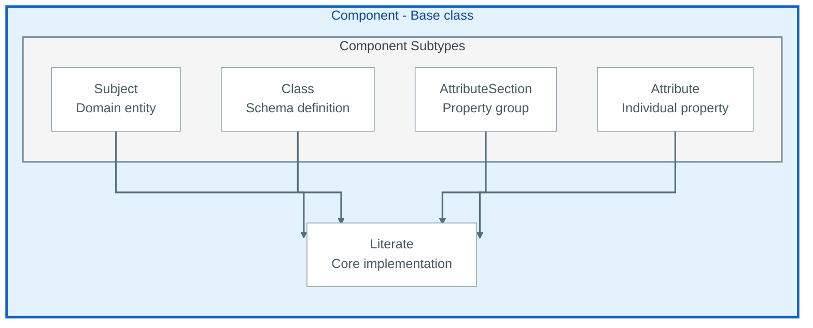

## Plant UML jsondata

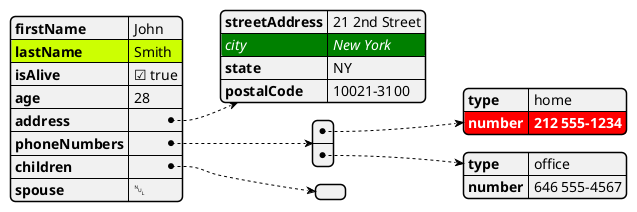

## Plant UML UML

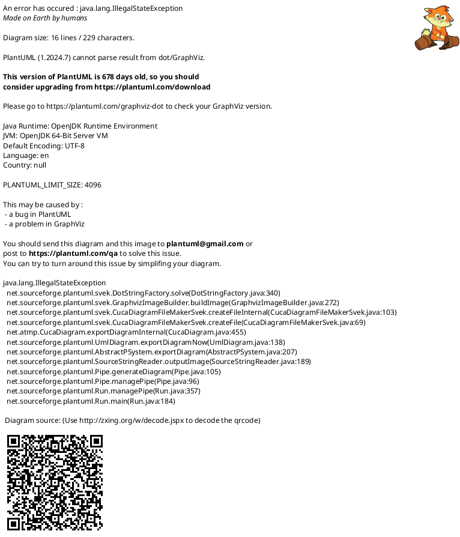

## Mermaid block diagram

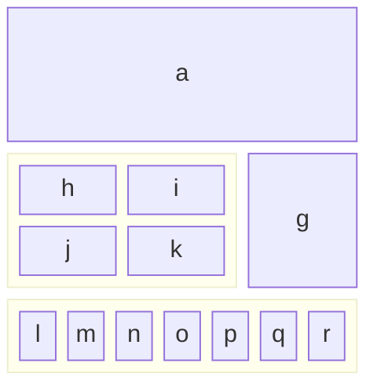

## Mermaid ER Diagram

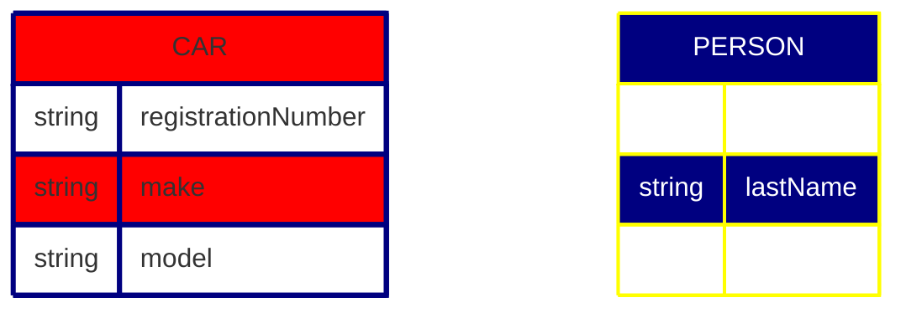

## Mermaid ER Diagram

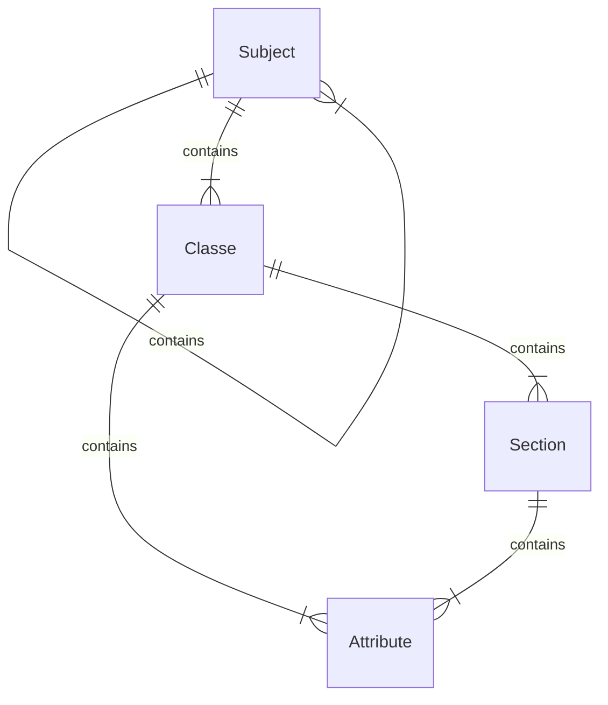

## Captioned figure

<figure>

+ 

+ <figcaption>Fig.1 - Trulli, Puglia, Italy.</figcaption>

+ </figure>


And the same figure with figure/caption markup


<figure title="A Drivers License">

+ 

+ <figcaption>My Non-Drivers License</figcaption>

+ </figure>


## List of Codes

```csv
eFormat, Description
E-Book, 'Kindle or Apple books - etc'
PDF, formatted for printing and direct delivery

```

## Plant UML UML

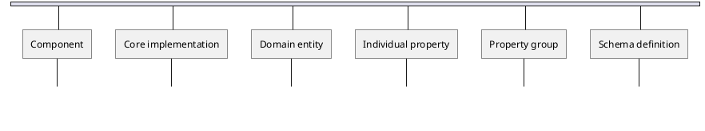

## Russian UML

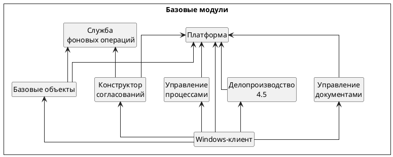

## Car diagram

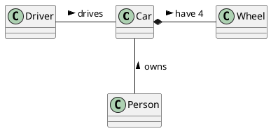

## Fancy Plant UML

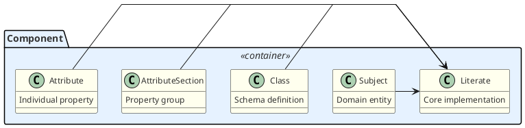

## Mind Map - PlanUML

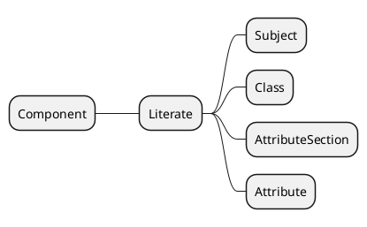

## JSON for Components

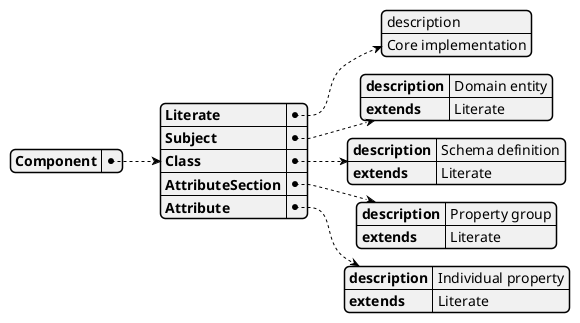

