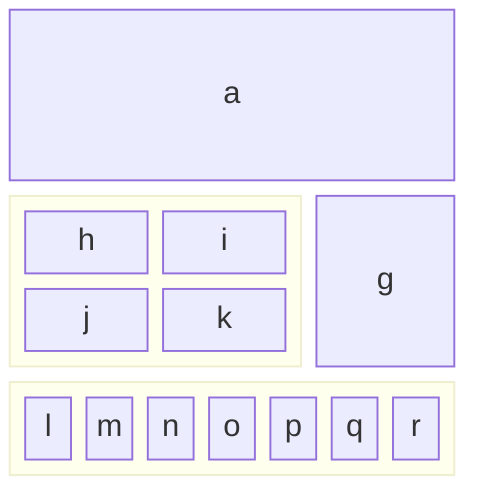

# Literate Tester

This is a small sample of a Literate Data Model, used for testing each of the constructs, at lease once.  
## Sample Classes - with a one liner for the subject, spanning
two lines

And an elaboration, with a few paragraphs

Paragraph 2


Paragraph 3


### Editions
Class Edition - a manifestation of a literary work
basedOn: Literary Work, Other Base
- Title - the title, as shown on the book's title page (Full Title)
	Default: the title of the Work of which this is an edition
	  Code: baseWork.title
- Author - the writer (Person)
- Illustrators - artists who supplied the pictures (List of People)
	Shows use of plural for class.
__ Optional Publication Details (Optional)
- Date Published - when the edition was released to the public (BiblioDate)
__ Required Format Details (Required)
- Number of pages  - last page number  (optional Integer)
__ Unsaid Other Details 
- Date Published - when the edition was released to the public (BiblioDate)

_ Hardcover Edition
subtype of: Edition, Work

_ Paperback Edition
subtype of: Edition by Format, Work by Something Else

_ Electronic Edition
subtype of: Edition
- eFormat - the precise medium for the electronic edition (Code)
```csv
eFormat, Description
E-Book, 'Kindle or Apple books - etc'
PDF, formatted for printing and direct delivery

```

Code Type: EBook Format - the precise medium for the electronic edition
```csv
Format, Description
E-Book, 'Kindle or Apple books - etc'
PDF, formatted for printing and direct delivery

```
### Addresses
Value Type: Address - a US Street address
- Street Address 1 - usually the street and number (Text)
- Street Address 2 - usually the apartment or unit number (Text)
- City (US City)
- State (US State)
__ Full ZipCode (Required)
- main zip code (Required Number)
  Must be: 5 digits
- precise zip code (Optiona Numberl)
  Must be: 4 digits

## Next steps
### Clean up

* Name parsing
* value types
* Rendering code blocks. capture language
* Subtypings - exclusive, exhaustive
* Data types with reference/value and cardinality
* Optional on Attribute Section
### Complete

* Code types
* And data block
### Validation

* cycles
* references to classes, subtypings
* references to attributes
### Flesh out

* Subtypes, subtypings
* inverse attributes
* Overrides what
* explicit for data type value/reference

### Futures

* Diagrams
## Tests to include
### Headers

Notice that, here, asterisks are used for lists and embedded list, so the items won't be confused with attributes

* Subject - w/ one-liner
* Class one-liner?, Value Type
* Attribute Section - optional?	
* Attribute Header
**  with and without one-liners
** with and without data type expressions
* Formulas, derivation, default, constraint
* Annotations 

### Name tests
* Variations
	* Styling
	* Anchors
* In:
	* Headers
	* Class lists
	* subtyping lists
	* 

### Class clauses

* Plural
* Abbreviation
* Subtype of
* Based on
* Where
* Diagnostics
* Annotations

Fleshed in
* Subtypes, subtypings
* Dependents
* Ancestors
* 
### Attribute clauses

* Data type
* Default
* Derivation
* Constraint
* Required/optional - if/unless

Fleshed in
* overrides
* inverse of
### Constraints and derivations

## More Tests needed
### Formula Tester
* English
* OCL
* Message
* Severity

### Data types

* Base Type. Reference vs Value
* List, set, mapping types
* Nested operators

_ Literary Work
- first Edition - a home for the data type clauses (List of Edition)

	data type: Edition
	data type: Edition reference
	data type: Edition value
	data type: List of Edition
		testing with singular for of class name
	
	data type: List of Editions
		testing for plural form should be equivalent
	data type: List of set of Editions
	data type: List of sets of Editions
	
_ Edition - to try more complex data types
- author - assuming just one
	data type: Person
- artists - allowing for multiple
	data type: list of People
- contributors
	data type: mapping of Roles to Lists of Person values
	data type: mapping of Role to List of People

	constraint: Must be several for each role
	code: len(contributors[role]) > 1 for each role
	message: not enough contributors for role
	severity: Error
	con note: constraints take annotations which may span 
	multiple lines.

	And those annotations may have their own elaborations.
	Which may contain more that one paragraph.

	Here's a second paragraph, followed by a code block
	``` markdown
	This is the code block for  the annotation
	```

	

	default: {'author': [a, b, c] }
	def ote: defaults take annotations

	derivation: {'author': [a, b, c] }
	der note: derivations take annotations

### Data type clauses

* Optionality
* Cardinality
## Elaborations
### Paragraphs

Unindented paragraph.
and not on next line and many subsequent lines
and not on next line and many subsequent lines
and not on next line and many subsequent lines
and not on next line and many subsequent lines
and not on next line and many subsequent lines
and not on next line and many subsequent lines

	Indented paragraph.
	and not on next line and many subsequent lines
	and not on next line and many subsequent lines
	and not on next line and many subsequent lines
	and not on next line and many subsequent lines
	and not on next line and many subsequent lines
	and not on next line and many subsequent lines

### Lists, indented lists
### Code blocks with language
### Block quotes

> paragraph with angle before first line
and not on next line and many subsequent lines
and not on next line and many subsequent lines
and not on next line and many subsequent lines
and not on next line and many subsequent lines
and not on next line and many subsequent lines
and not on next line and many subsequent lines

> parag with angles on every line
> next line
> next line

Nested block quotes

> paragraph with angle before first line
and not on next line and many subsequent lines
and not on next line and many subsequent lines
and not on next line and many subsequent lines
and not on next line and many subsequent lines
and not on next line and many subsequent lines
and not on next line and many subsequent lines
>> Nested goes here
and not on next line and many subsequent lines
and not on next line and many subsequent lines
and not on next line and many subsequent lines
and not on next line and many subsequent lines
and not on next line and many subsequent lines
and not on next line and many subsequent lines
### Pseudo admonitions

This is a :warning: Don't do that

> :warning: **Warning:** 
> Do not push the big red button.

> :memo: **Note:** Sunrises are beautiful.

> :bulb: **Tip:** Remember to appreciate the little things in life.

So, how do I insert an emoji?  🐛
In Obsidian the colon, after a space? 🛰

### Markdown code blocks?
```markdown
This is some text, with indented lists
- Item
- Item2
- Item 3
	- Item a 
	- Item b
	- Item c
```


### Code Tables - CSV Codeblock
So. This is the **one to use to enter codes**, lists of annotations, etc


```csv
Pos, Date, Name, Price
1, 2023-09-28, Spices, 150$
2, 2023-02-29, Shovel, 1.25$
```


### HTML code
<center>
This should be centered
</center>
### Comments

Here's a paragraph that will be visible.
(Hard to see what's required: blank lines?]

[This is a comment that will be hidden.]: # 


[This is a comment] #


[This is a comment that will be hidden.]: # 

And here's another paragraph that's visible.


### Figures
![[DSC00273 Copy.jpg]]

just copy and paste into Obsidian page (or drag and drop)

Captions are harder

## Diagrams
Just use Mermaid in code block
``` (mermaid)

block-beta
  columns 3
  a:3
  block:group1:2
    columns 2
    h i j k
  end
  g
  block:group2:3
    %% columns auto (default)
    l m n o p q r
  end
```

And here's the result



## Admonitions
```ad-tip
title: This is a tip 
This is the content of the admonition tip. 
```
### Obsidian Callouts

> [!info]
> Here's a callout block.
> It supports **Markdown**, [[Internal link|Wikilinks]], and [[Embed files|embeds]]!
> ![[Engelbart.jpg]]

> [!note]
> Lorem ipsum dolor sit amet


> [!abstract]
> Lorem ipsum dolor sit amet

> [!question]
> Lorem ipsum dolor sit amet


>[!question]
>Why is the sky blue?


## Capabilities
### To PDF
### To HTML
### Prettify
### Edit in VS Code
### TOC
### Index

