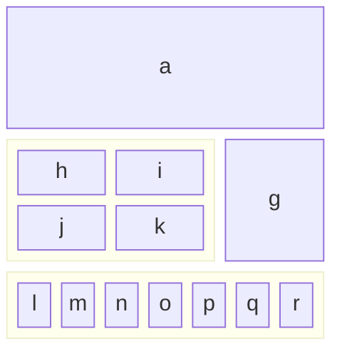
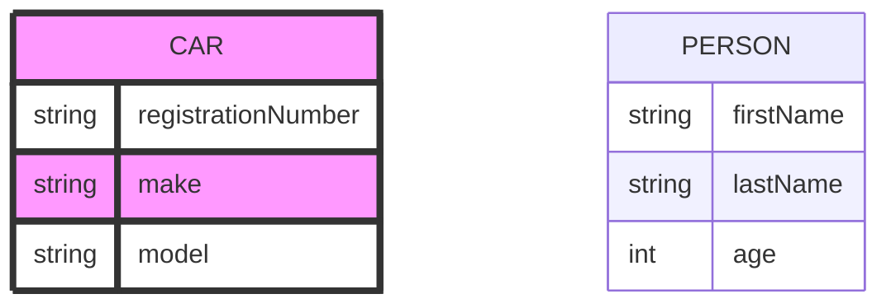

# Literate Tester

This is a small sample of a Literate Data Model, used for testing each of the constructs, at lease once.  
## Sample Classes - with a one liner for the subject, spanning
two lines

And an elaboration, with a few paragraphs

Paragraph 2


Paragraph 3

### HeaderB

#### HeaderC


### Editions
Class Edition - a manifestation of a literary work
basedOn: Literary Work, Other Base
- Title - the title, as shown on the book's title page (Full Title)
	Default: the title of the Work of which this is an edition
	  Code: baseWork.title
- Author - the writer (Person)
- Illustrators - artists who supplied the pictures (List of People)
	Shows use of plural for class.
__ Optional Publication Details (Optional)
- Date Published - when the edition was released to the public (BiblioDate)
__ Required Format Details (Required)
- Number of pages  - last page number  (optional Integer)
__ Unsaid Other Details 
- Date Published - when the edition was released to the public (BiblioDate)


Just use Mermaid in code block

``` notmermaid

block-beta
  columns 3
  a:3
  block:group1:2
    columns 2
    h i j k
  end
  g
  block:group2:3
    %% columns auto (default)
    l m n o p q r
  end

```

And here's the result





_ Hardcover Edition
subtype of: Edition, Work

``` mermaid
erDiagram


    class Subject Component
    class Section Component
    class Attribute Component
    class Class Component
    
    SUBJECT {
        string name

    }
    Subject ||--|{ Subject : contains
    Subject ||--|{ Class : contains
    Class {
        string name
    }

    Class ||--|{ Section : contains
    Class ||--|{ Attribute : contains
    Attribute {

        string name
    }
	Section ||--|{ Attribute : contains


```
_ Paperback Edition
subtype of: Edition by Format, Work by Something Else

And in the elaboration, a figure:

<figure title="Title on the Figure tag">
  
  <figcaption>Fig.1 - Trulli, Puglia, Italy.</figcaption>
</figure>
And the same figure with figure/caption markup

<figure >
	
	<figcaption>My Non-Drivers License</figcaption>
</figure>
and a list of codes

```csv
eFormat, Description
E-Book, 'Kindle or Apple books - etc'
PDF, formatted for printing and direct delivery

```


_ Electronic Edition
subtype of: Edition
- eFormat - the precise medium for the electronic edition (Code)
```csv
eFormat, Description
E-Book, 'Kindle or Apple books - etc'
PDF, formatted for printing and direct delivery

```

Code Type: EBook Format - the precise medium for the electronic edition
```csv
Format, Description
E-Book, 'Kindle or Apple books - etc'
PDF, formatted for printing and direct delivery

```
### Addresses
Value Type: Address - a US Street address
- Street Address 1 - usually the street and number (Text)
- Street Address 2 - usually the apartment or unit number (Text)
- City (US City)
- State (US State)
__ Full ZipCode (Required)
- main zip code (Required Number)
  Must be: 5 digits
- precise zip code (Optiona Numberl)
  Must be: 4 digits

## Next steps
### Clean up

* Name parsing
* value types
* Rendering code blocks. capture language
* Subtypings - exclusive, exhaustive
* Data types with reference/value and cardinality
* Optional on Attribute Section
### Complete

* Code types
* And data block
### Validation

* cycles
* references to classes, subtypings
* references to attributes
### Flesh out

* Subtypes, subtypings
* inverse attributes
* Overrides what
* explicit for data type value/reference

### Futures

* Diagrams
## Tests to include
### Headers

Notice that, here, asterisks are used for lists and embedded list, so the items won't be confused with attributes

* Subject - w/ one-liner
* Class one-liner?, Value Type
* Attribute Section - optional?	
* Attribute Header
**  with and without one-liners
** with and without data type expressions
* Formulas, derivation, default, constraint
* Annotations 

### Name tests
* Variations
	* Styling
	* Anchors
* In:
	* Headers
	* Class lists
	* subtyping lists
	* 

### Class clauses

* Plural
* Abbreviation
* Subtype of
* Based on
* Where
* Diagnostics
* Annotations

Fleshed in
* Subtypes, subtypings
* Dependents
* Ancestors
* 
### Attribute clauses

* Data type
* Default
* Derivation
* Constraint
* Required/optional - if/unless

Fleshed in
* overrides
* inverse of
### Constraints and derivations

## More Tests needed
### Formula Tester
* English
* OCL
* Message
* Severity

### Data types

* Base Type. Reference vs Value
* List, set, mapping types
* Nested operators

_ Literary Work
- first Edition - a home for the data type clauses (List of Edition)

	data type: Edition
	data type: Edition reference
	data type: Edition value
	data type: List of Edition
		testing with singular for of class name
	
	data type: List of Editions
		testing for plural form should be equivalent
	data type: List of set of Editions
	data type: List of sets of Editions
	
_ Edition - to try more complex data types
- author - assuming just one
	data type: Person
- artists - allowing for multiple
	data type: list of People
- contributors
	data type: mapping of Roles to Lists of Person values
	data type: mapping of Role to List of People

	constraint: Must be several for each role
	code: len(contributors[role]) > 1 for each role
	message: not enough contributors for role
	severity: Error
	constrain note: constraints take annotations which may span 
	multiple lines.

	And those annotations may have their own elaborations.
	Which may contain more that one paragraph.

	Here's a second paragraph, followed by a code block
	``` markdown
	This is the code block for  the annotation
	```

	

	default: {'author': [a, b, c] }
	defaul note: defaults take annotations

	derivation: {'author': [a, b, c] }
	derivatio note: derivations take annotations

### Data type clauses

* Optionality
* Cardinality
## Elaborations
### Paragraphs

Unindented paragraph.
and not on next line and many subsequent lines
and not on next line and many subsequent lines
and not on next line and many subsequent lines
and not on next line and many subsequent lines
and not on next line and many subsequent lines
and not on next line and many subsequent lines

	Indented paragraph.
	and not on next line and many subsequent lines
	and not on next line and many subsequent lines
	and not on next line and many subsequent lines
	and not on next line and many subsequent lines
	and not on next line and many subsequent lines
	and not on next line and many subsequent lines

### Lists, indented lists
### Code blocks with language
### Block quotes

> paragraph with angle before first line
and not on next line and many subsequent lines
and not on next line and many subsequent lines
and not on next line and many subsequent lines
and not on next line and many subsequent lines
and not on next line and many subsequent lines
and not on next line and many subsequent lines

> parag with angles on every line
> next line
> next line

Nested block quotes

> paragraph with angle before first line
and not on next line and many subsequent lines
and not on next line and many subsequent lines
and not on next line and many subsequent lines
and not on next line and many subsequent lines
and not on next line and many subsequent lines
and not on next line and many subsequent lines
>> Nested goes here
and not on next line and many subsequent lines
and not on next line and many subsequent lines
and not on next line and many subsequent lines
and not on next line and many subsequent lines
and not on next line and many subsequent lines
and not on next line and many subsequent lines
### Pseudo admonitions

This is a :warning: Don't do that

> :warning: **Warning:** 
> Do not push the big red button.

> :memo: **Note:** Sunrises are beautiful.

> :bulb: **Tip:** Remember to appreciate the little things in life.

So, how do I insert an emoji?  🐛
In Obsidian the colon, after a space? 🛰

### Markdown code blocks?
```markdown
This is some text, with indented lists
- Item
- Item2
- Item 3
	- Item a 
	- Item b
	- Item c
```


### Code Tables - CSV Codeblock
So. This is the **one to use to enter codes**, lists of annotations, etc


```csv
Pos, Date, Name, Price
1, 2023-09-28, Spices, 150$
2, 2023-02-29, Shovel, 1.25$
```


### HTML code
<center>
This should be centered
</center>
### Comments

Here's a paragraph that will be visible.
(Hard to see what's required: blank lines?]

[This is a comment that will be hidden.]: # 


[This is a comment] #


[This is a comment that will be hidden.]: # 

And here's another paragraph that's visible.

## Diagrams

### Figures

1. First item
	- A
			![[FMKNYIDFrontIMG_1141.jpg]]
	- B
	- C
2. Second item
	![[FMKNYIDFrontIMG_1141.jpg]]
3. Third item
Now, some paragraphs inside of nested List
* Item 1
	![[FMKNYIDFrontIMG_1141.jpg]]
** Item 1a
*** Item 1a
**** Item 1a
	![[FMKNYIDFrontIMG_1141.jpg]]

** Item 1b
* *
![[FMKNYIDFrontIMG_1141.jpg]]


And now with a caption?


[[https://obsidian.md/logo.png]]
just copy and paste into Obsidian page (or drag and drop)

Captions are harder


[Not visible in Editing mode](https://obsidian.md/logo.png)
### Figure caption
<figure>
	![[FMKNYIDFrontIMG_1141.jpg]]
<figcaption>
This is the caption
</figcaption>
</figure>


## Admonitions
```ad-tip
title: This is a tip 
This is the content of the admonition tip. 
```
### Obsidian Callouts

> [!info]
> Here's a callout block.
> It supports **Markdown**, [[Internal link|Wikilinks]], and [[Embed files|embeds]]!
> ![[Engelbart.jpg]]

> [!note]
> Lorem ipsum dolor sit amet


> [!abstract]
> Lorem ipsum dolor sit amet

> [!question]
> Lorem ipsum dolor sit amet


>[!question]
>Why is the sky blue?


## Capabilities
### To PDF
### To HTML
### Prettify
### Edit in VS Code
### TOC
### Index

_ NewClass - just to see if it does that
## Markdown: Syntax

*   [Overview](#overview)
	*   [Philosophy](#philosophy)
	*   [Inline HTML](#html)
	*   [Automatic Escaping for Special Characters](#autoescape)
*   [Block Elements](#block)
	*   [Paragraphs and Line Breaks](#p)
	*   [Headers](#header)
	*   [Blockquotes](#blockquote)
	*   [Lists](#list)
	*   [Code Blocks](#precode)
	*   [Horizontal Rules](#hr)
*   [Span Elements](#span)
	*   [Links](#link)
	*   [Emphasis](#em)
	*   [Code](#code)
	*   [Images](#img)
*   [Miscellaneous](#misc)
	*   [Backslash Escapes](#backslash)
	*   [Automatic Links](#autolink)


**Note:** This document is itself written using Markdown; you
can [see the source for it by adding '.text' to the URL](/projects/markdown/syntax.text).

----

### Overview

#### Philosophy

Markdown is intended to be as easy-to-read and easy-to-write as is feasible.

Readability, however, is emphasized above all else. A Markdown-formatted
document should be publishable as-is, as plain text, without looking
like it's been marked up with tags or formatting instructions. While
Markdown's syntax has been influenced by several existing text-to-HTML
filters -- including [Setext](http://docutils.sourceforge.net/mirror/setext.html), [atx](http://www.aaronsw.com/2002/atx/), [Textile](http://textism.com/tools/textile/), [reStructuredText](http://docutils.sourceforge.net/rst.html),
[Grutatext](http://www.triptico.com/software/grutatxt.html), and [EtText](http://ettext.taint.org/doc/) -- the single biggest source of
inspiration for Markdown's syntax is the format of plain text email.

### Block Elements

#### Paragraphs and Line Breaks

A paragraph is simply one or more consecutive lines of text, separated
by one or more blank lines. (A blank line is any line that looks like a
blank line -- a line containing nothing but spaces or tabs is considered
blank.) Normal paragraphs should not be indented with spaces or tabs.

The implication of the "one or more consecutive lines of text" rule is
that Markdown supports "hard-wrapped" text paragraphs. This differs
significantly from most other text-to-HTML formatters (including Movable
Type's "Convert Line Breaks" option) which translate every line break
character in a paragraph into a `<br />` tag.

When you *do* want to insert a `<br />` break tag using Markdown, you
end a line with two or more spaces, then type return.

#### Headers

Markdown supports two styles of headers, [Setext] [1] and [atx] [2].

Optionally, you may "close" atx-style headers. This is purely
cosmetic -- you can use this if you think it looks better. The
closing hashes don't even need to match the number of hashes
used to open the header. (The number of opening hashes
determines the header level.)


#### Blockquotes

Markdown uses email-style `>` characters for blockquoting. If you're
familiar with quoting passages of text in an email message, then you
know how to create a blockquote in Markdown. It looks best if you hard
wrap the text and put a `>` before every line:

> This is a blockquote with two paragraphs. Lorem ipsum dolor sit amet,
> consectetuer adipiscing elit. Aliquam hendrerit mi posuere lectus.
> Vestibulum enim wisi, viverra nec, fringilla in, laoreet vitae, risus.
> 
> Donec sit amet nisl. Aliquam semper ipsum sit amet velit. Suspendisse
> id sem consectetuer libero luctus adipiscing.

Markdown allows you to be lazy and only put the `>` before the first
line of a hard-wrapped paragraph:

> This is a blockquote with two paragraphs. Lorem ipsum dolor sit amet,
consectetuer adipiscing elit. Aliquam hendrerit mi posuere lectus.
Vestibulum enim wisi, viverra nec, fringilla in, laoreet vitae, risus.

> Donec sit amet nisl. Aliquam semper ipsum sit amet velit. Suspendisse
id sem consectetuer libero luctus adipiscing.

Blockquotes can be nested (i.e. a blockquote-in-a-blockquote) by
adding additional levels of `>`:

> This is the first level of quoting.
>
> > This is nested blockquote.
>
> Back to the first level.

Blockquotes can contain other Markdown elements, including headers, lists,
and code blocks:

> ## This is a header.
> 
> 1.   This is the first list item.
> 2.   This is the second list item.
> 
> Here's some example code:
> 
>     return shell_exec("echo $input | $markdown_script");

Any decent text editor should make email-style quoting easy. For
example, with BBEdit, you can make a selection and choose Increase
Quote Level from the Text menu.


#### Lists

Markdown supports ordered (numbered) and unordered (bulleted) lists.

Unordered lists use asterisks, pluses, and hyphens -- interchangably
-- as list markers:

*   Red
*   Green
*   Blue

is equivalent to:

+   Red
+   Green
+   Blue

and:

-   Red
-   Green
-   Blue

Ordered lists use numbers followed by periods:

1.  Bird
2.  McHale
3.  Parish

It's important to note that the actual numbers you use to mark the
list have no effect on the HTML output Markdown produces. The HTML
Markdown produces from the above list is:

If you instead wrote the list in Markdown like this:

1.  Bird
1.  McHale
1.  Parish

or even:

3. Bird
1. McHale
8. Parish

you'd get the exact same HTML output. The point is, if you want to,
you can use ordinal numbers in your ordered Markdown lists, so that
the numbers in your source match the numbers in your published HTML.
But if you want to be lazy, you don't have to.

To make lists look nice, you can wrap items with hanging indents:

*   Lorem ipsum dolor sit amet, consectetuer adipiscing elit.
	Aliquam hendrerit mi posuere lectus. Vestibulum enim wisi,
	viverra nec, fringilla in, laoreet vitae, risus.
*   Donec sit amet nisl. Aliquam semper ipsum sit amet velit.
	Suspendisse id sem consectetuer libero luctus adipiscing.

But if you want to be lazy, you don't have to:

*   Lorem ipsum dolor sit amet, consectetuer adipiscing elit.
Aliquam hendrerit mi posuere lectus. Vestibulum enim wisi,
viverra nec, fringilla in, laoreet vitae, risus.
*   Donec sit amet nisl. Aliquam semper ipsum sit amet velit.
Suspendisse id sem consectetuer libero luctus adipiscing.

List items may consist of multiple paragraphs. Each subsequent
paragraph in a list item must be indented by either 4 spaces
or one tab:

1.  This is a list item with two paragraphs. Lorem ipsum dolor
	sit amet, consectetuer adipiscing elit. Aliquam hendrerit
	mi posuere lectus.

	Vestibulum enim wisi, viverra nec, fringilla in, laoreet
	vitae, risus. Donec sit amet nisl. Aliquam semper ipsum
	sit amet velit.

2.  Suspendisse id sem consectetuer libero luctus adipiscing.

It looks nice if you indent every line of the subsequent
paragraphs, but here again, Markdown will allow you to be
lazy:

*   This is a list item with two paragraphs.

	This is the second paragraph in the list item. You're
only required to indent the first line. Lorem ipsum dolor
sit amet, consectetuer adipiscing elit.

*   Another item in the same list.

To put a blockquote within a list item, the blockquote's `>`
delimiters need to be indented:

*   A list item with a blockquote:

	> This is a blockquote
	> inside a list item.

To put a code block within a list item, the code block needs
to be indented *twice* -- 8 spaces or two tabs:

*   A list item with a code block:

		<code goes here>

#### Code Blocks

Pre-formatted code blocks are used for writing about programming or
markup source code. Rather than forming normal paragraphs, the lines
of a code block are interpreted literally. Markdown wraps a code block
in both `<pre>` and `<code>` tags.

To produce a code block in Markdown, simply indent every line of the
block by at least 4 spaces or 1 tab.

This is a normal paragraph:

	This is a code block.

Here is an example of AppleScript:

	tell application "Foo"
		beep
	end tell

A code block continues until it reaches a line that is not indented
(or the end of the article).

Within a code block, ampersands (`&`) and angle brackets (`<` and `>`)
are automatically converted into HTML entities. This makes it very
easy to include example HTML source code using Markdown -- just paste
it and indent it, and Markdown will handle the hassle of encoding the
ampersands and angle brackets. For example, this:

	<div class="footer">
		&copy; 2004 Foo Corporation
	</div>

Regular Markdown syntax is not processed within code blocks. E.g.,
asterisks are just literal asterisks within a code block. This means
it's also easy to use Markdown to write about Markdown's own syntax.

```
tell application "Foo"
	beep
end tell
```

### Span Elements

#### Links

Markdown supports two style of links: *inline* and *reference*.

In both styles, the link text is delimited by [square brackets].

To create an inline link, use a set of regular parentheses immediately
after the link text's closing square bracket. Inside the parentheses,
put the URL where you want the link to point, along with an *optional*
title for the link, surrounded in quotes. For example:

This is [an example](http://example.com/) inline link.

[This link](http://example.net/) has no title attribute.

#### Emphasis

Markdown treats asterisks (`*`) and underscores (`_`) as indicators of
emphasis. Text wrapped with one `*` or `_` will be wrapped with an
HTML `<em>` tag; double `*`'s or `_`'s will be wrapped with an HTML
`<strong>` tag. E.g., this input:

*single asterisks*

_single underscores_

**double asterisks**

__double underscores__

#### Code

To indicate a span of code, wrap it with backtick quotes (`` ` ``).
Unlike a pre-formatted code block, a code span indicates code within a
normal paragraph. For example:

Use the `printf()` function.