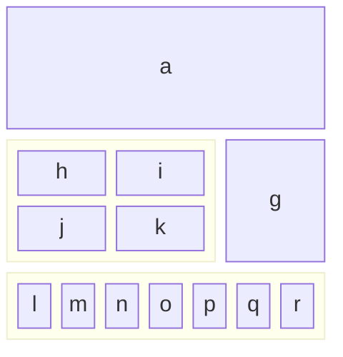
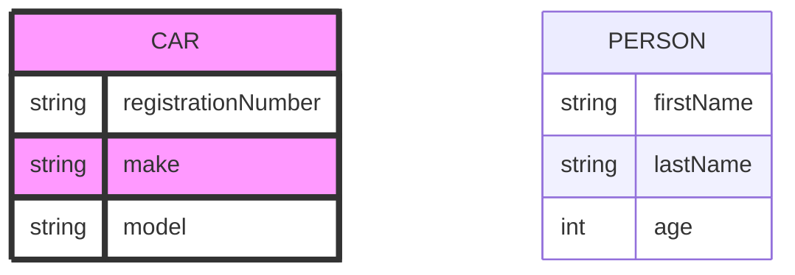

# None

This is a small sample of a Literate Data Model, used for testing each of the
constructs, at lease once.


!! Error: Name is missing

## Sample Classes - with a one liner for the subject, spanning two lines

And an elaboration, with a few paragraphs


Paragraph 2


Paragraph 3


### Header B

#### Header C

### Editions

_ **Edition** - a manifestation of a literary work

_basedOn_: LiteraryWork, OtherBase
- ***title*** - the title, as shown on the book's title page (optional reference
FullTitle)

- ***author*** - the writer (optional reference Person)

- ***illustrators*** - artists who supplied the pictures (optional List of
reference People)

__ _Optional Publication Details_ (Optional)

- ***datePublished*** - when the edition was released to the public (optional
reference BiblioDate)

__ _Required Format Details_ ()

- ***numberOfPages*** - last page number (optional reference Integer)

__ _Unsaid Other Details_ ()

- ***datePublished*** - when the edition was released to the public (optional
reference BiblioDate)

Just use Mermaid in code block


``` notmermaid

block-beta
columns 3
a:3
block:group1:2
columns 2
h i j k
end
g
block:group2:3
%% columns auto (default)
l m n o p q r
end

```

And here's the result






_ **HardcoverEdition**

``` mermaid
erDiagram


class Subject Component
class Section Component
class Attribute Component
class Class Component

SUBJECT {
string name

}
Subject ||--|{ Subject : contains
Subject ||--|{ Class : contains
Class {
string name
}

Class ||--|{ Section : contains
Class ||--|{ Attribute : contains
Attribute {

string name
}
Section ||--|{ Attribute : contains


```

_subtypeOf_: Edition subtypes, Work subtypes
_ **PaperbackEdition**

And in the elaboration, a figure:


<figure title="Title on the Figure tag">

+ 

+ <figcaption>Fig.1 - Trulli, Puglia, Italy.</figcaption>

+ </figure>

+ And the same figure with figure/caption markup


<figure >

+ 

+ <figcaption>My Non-Drivers License</figcaption>

+ </figure>

+ and a list of codes


```csv
eFormat, Description
E-Book, 'Kindle or Apple books - etc'
PDF, formatted for printing and direct delivery

```

_subtypeOf_: Edition byFormat, Work bySomethingElse
_ **ElectronicEdition**

_subtypeOf_: Edition subtypes
- ***eFormat*** - the precise medium for the electronic edition (optional
reference Code)

```csv
eFormat, Description
E-Book, 'Kindle or Apple books - etc'
PDF, formatted for printing and direct delivery

```

Code Type: **EBookFormat** - the precise medium for the electronic edition

```csv
Format, Description
E-Book, 'Kindle or Apple books - etc'
PDF, formatted for printing and direct delivery

```

_isValueType_: True
### Addresses

Value Type: **Address** - a US Street address

_isValueType_: True
- ***streetAddress*** - usually the street and number (optional reference Text)

- ***streetAddress*** - usually the apartment or unit number (optional reference
Text)

- ***city*** (optional reference UsCity)

- ***state*** (optional reference UsState)

__ _Full Zip Code_ ()

- ***mainZipCode*** (optional reference RequiredNumber)

Must be: 5 digits
- ***preciseZipCode*** (optional reference OptionaNumberl)

Must be: 4 digits
## Next steps

### Clean up

* Name parsing

+ * value types

+ * Rendering code blocks. capture language

+ * Subtypings - exclusive, exhaustive

+ * Data types with reference/value and cardinality

+ * Optional on Attribute Section


### Complete

* Code types

+ * And data block


### Validation

* cycles

+ * references to classes, subtypings

+ * references to attributes


### Flesh out

* Subtypes, subtypings

+ * inverse attributes

+ * Overrides what

+ * explicit for data type value/reference


### Futures

* Diagrams


## Tests to include

### Headers

Notice that, here, asterisks are used for lists and embedded list, so the items
won't be confused with attributes


* Subject - w/ one-liner

+ * Class one-liner?, Value Type

+ * Attribute Section - optional?

+ * Attribute Header

+ **  with and without one-liners

+ ** with and without data type expressions

+ * Formulas, derivation, default, constraint

+ * Annotations


### Name tests Variations Styling Anchors

In:
### Class clauses

* Plural

+ * Abbreviation

+ * Subtype of

+ * Based on

+ * Where

+ * Diagnostics

+ * Annotations


Fleshed in

+ * Subtypes, subtypings

+ * Dependents

+ * Ancestors

+ *


### Attribute clauses

* Data type

+ * Default

+ * Derivation

+ * Constraint

+ * Required/optional - if/unless


Fleshed in

+ * overrides

+ * inverse of


### Constraints and derivations

## More Tests needed

### Formula Tester English OCL Message Severity

### Data types

* Base Type. Reference vs Value

+ * List, set, mapping types

+ * Nested operators


_ **LiteraryWork**

- ***firstEdition*** - a home for the data type clauses (optional List of
reference Edition)

_ **Edition** - to try more complex data types

- ***author*** - assuming just one

- ***artists*** - allowing for multiple

- ***contributors***

constrain note: constraints take annotations which may span
defaul note: defaults take annotations
derivatio note: derivations take annotations
### Data type clauses

* Optionality

+ * Cardinality


## Elaborations

### Paragraphs

Unindented paragraph.

+ and not on next line and many subsequent lines

+ and not on next line and many subsequent lines

+ and not on next line and many subsequent lines

+ and not on next line and many subsequent lines

+ and not on next line and many subsequent lines

+ and not on next line and many subsequent lines


Indented paragraph.

+ and not on next line and many subsequent lines

+ and not on next line and many subsequent lines

+ and not on next line and many subsequent lines

+ and not on next line and many subsequent lines

+ and not on next line and many subsequent lines

+ and not on next line and many subsequent lines


### Lists indented lists

### Code blocks with language

### Block quotes

> paragraph with angle before first line

+ and not on next line and many subsequent lines

+ and not on next line and many subsequent lines

+ and not on next line and many subsequent lines

+ and not on next line and many subsequent lines

+ and not on next line and many subsequent lines

+ and not on next line and many subsequent lines


> parag with angles on every line

+ > next line

+ > next line


Nested block quotes


> paragraph with angle before first line

+ and not on next line and many subsequent lines

+ and not on next line and many subsequent lines

+ and not on next line and many subsequent lines

+ and not on next line and many subsequent lines

+ and not on next line and many subsequent lines

+ and not on next line and many subsequent lines

+ >> Nested goes here

+ and not on next line and many subsequent lines

+ and not on next line and many subsequent lines

+ and not on next line and many subsequent lines

+ and not on next line and many subsequent lines

+ and not on next line and many subsequent lines

+ and not on next line and many subsequent lines


### Pseudo admonitions

This is a: warning: Don't do that
### Markdown code blocks

```markdown
This is some text, with indented lists
- Item
- Item2
- Item 3
- Item a
- Item b
- Item c
```

### Code Tables - CSV Codeblock So. This is the **one to use to enter codes**,
lists of annotations, etc

```csv
Pos, Date, Name, Price
1, 2023-09-28, Spices, 150$
2, 2023-02-29, Shovel, 1.25$
```

### HTML code center This should be centered center

### Comments

Here's a paragraph that will be visible.

+ (Hard to see what's required: blank lines?]


[This is a comment that will be hidden.]: #


[This is a comment] #


[This is a comment that will be hidden.]: #


And here's another paragraph that's visible.


## Diagrams

### Figures

1. First item


