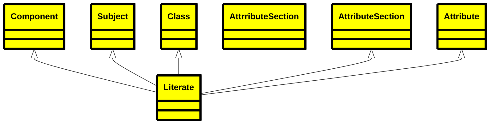
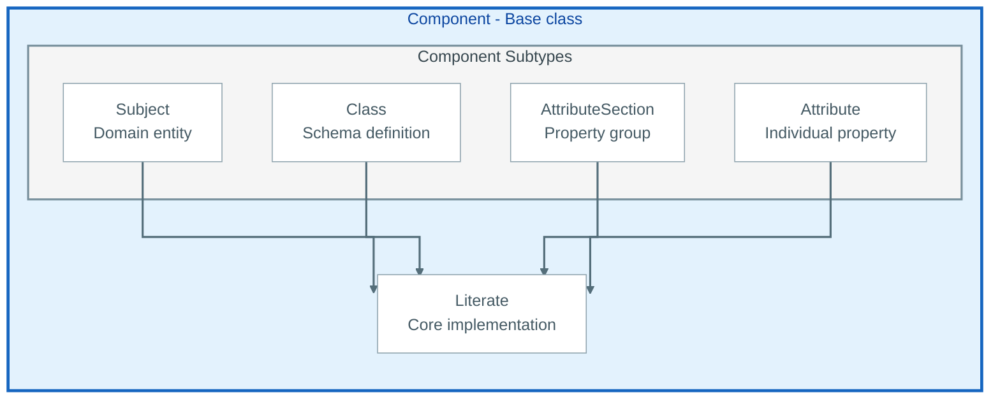
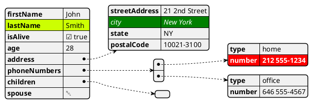
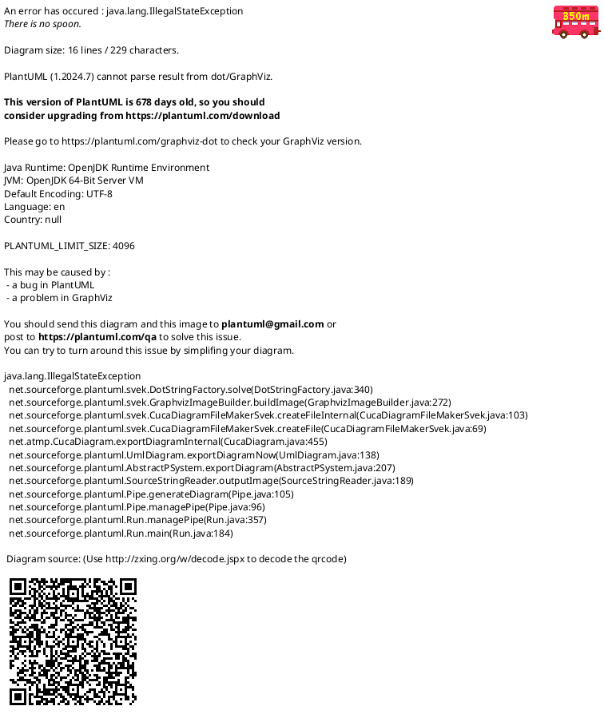
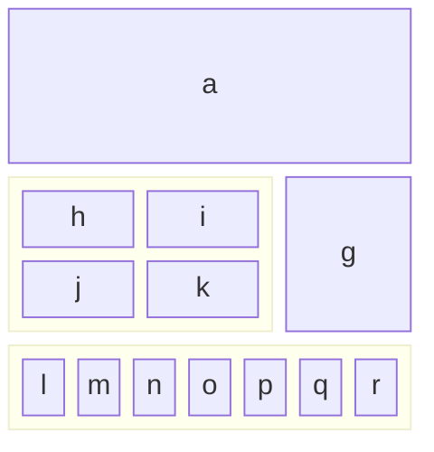
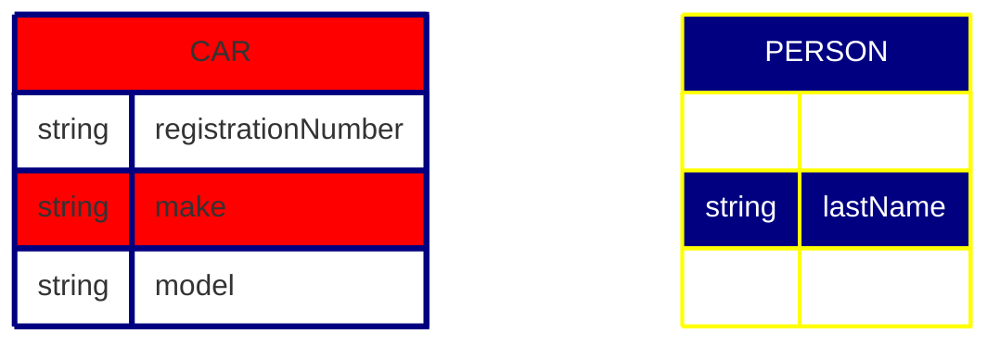
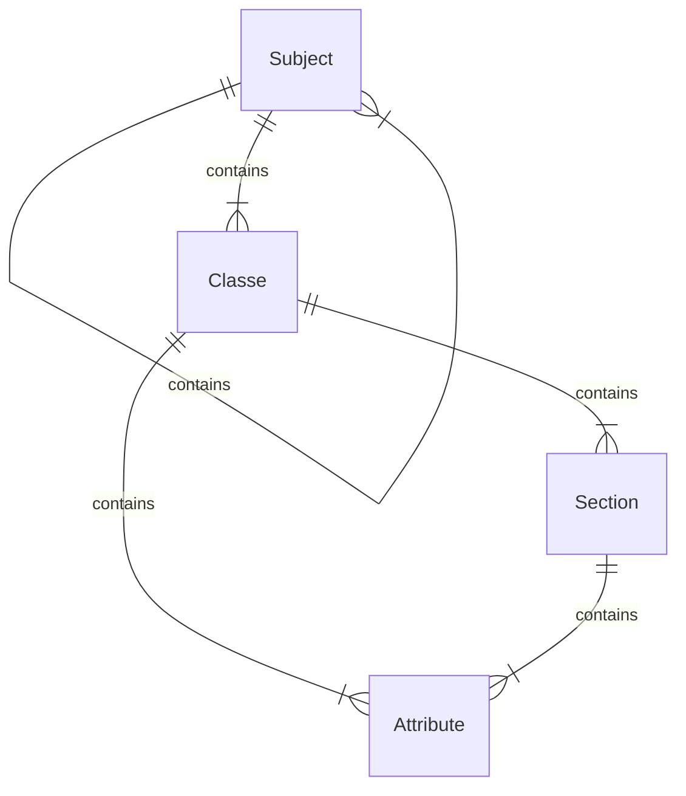
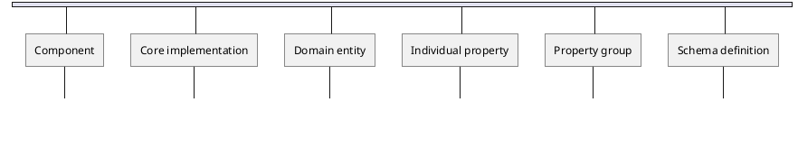
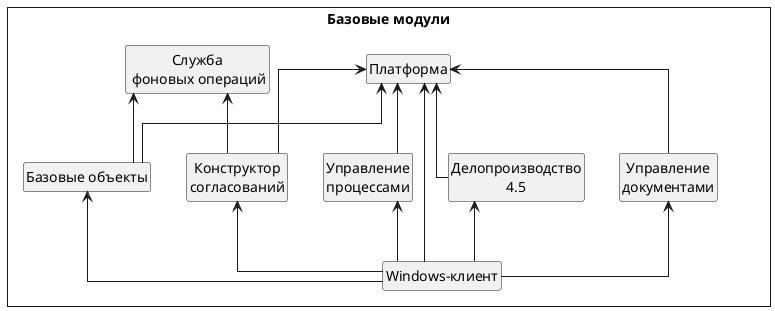
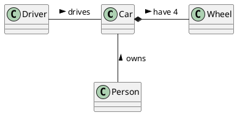

# This is my first Mermaid test

## Mermaid Class Diagram




## Mermaid Flowchart


## PlantUML jsondata



## PlantUML UML





## Mermaid ER Diagram


## Mermaid ER Diagram


## Captioned figure
<figure>
  
  <figcaption>Fig.1 - Trulli, Puglia, Italy.</figcaption>
</figure>
And the same figure with figure/caption markup

<figure title="A Drivers License">
	
	<figcaption>My Non-Drivers License</figcaption>
</figure>

## List of Codes

```csv
eFormat, Description
E-Book, 'Kindle or Apple books - etc'
PDF, formatted for printing and direct delivery

```

## UML


## Russian UML

## Car diagram


## and a dummy section

