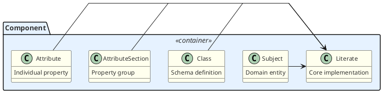
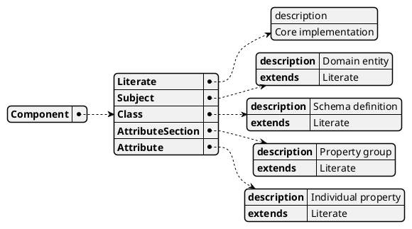

## way more


## MindMap

```puml

@startmindmap
* Component
** Literate
*** Subject
*** Class
*** AttributeSection
*** Attribute
@endmindmap
@startuml
!include <C4/C4_Component>

Person(user, "User")
Container_Boundary(component, "Component") {
  Component(literate, "Literate", "Core implementation")
  Component(subject, "Subject", "Domain entity")
  Component(class, "Class", "Schema definition")
  Component(attributeSection, "AttributeSection", "Property group")
  Component(attribute, "Attribute", "Individual property")
}

Rel(subject, literate, "extends")
Rel(class, literate, "extends")
Rel(attributeSection, literate, "extends")
Rel(attribute, literate, "extends")
@enduml

@startjson
{
  "Component": {
    "Literate": {"description": "Core implementation"},
    "Subject": {"description": "Domain entity", "extends": "Literate"},
    "Class": {"description": "Schema definition", "extends": "Literate"},
    "AttributeSection": {"description": "Property group", "extends": "Literate"},
    "Attribute": {"description": "Individual property", "extends": "Literate"}
  }
}
@endjson
```



```puml
@startjson

{
  "_type": "LDM",
  "prefix": "#",
  "name": "Literate Data Model",
  "one_liner": "a detailed descriptionof the contents",
  "parenthetical": "",
  "elaboration": [
    {
      "_type": "Paragraph",
      "content": "This is a section with no real content, except for these intro words and other sections. \n+ And this is the elaboration"
    }
  ],
  "subjects": [
    {
      "_type": "SubjectB",
      "prefix": "##",
      "name": "Preliminaries",
      "one_liner": "the basic structureof the model",
      "parenthetical": "",
      "elaboration": [
        {
          "_type": "Paragraph",
          "content": "In Literate Data Modeling, the main components of interest are typically Classes, Attributes, Models, and Subjects. However, to streamline the model and promote reusability, we introduce a supertype called Component. By defining common attributes and behaviors in the Component class, we can inherit them in the subclasses, ensuring consistency and reducing duplication throughout the model."
        },
        {
          "_type": "CodeBlock",
          "content": "```Sample code block between paragraphs\n - x <  y and y > z\n - ```"
        },
        {
          "_type": "Paragraph",
          "content": "We present the Component class first because it is a best practice in modeling to introduce supertypes before their subtypes. This approach allows readers to understand the general concepts and shared properties before delving into the specifics of each specialized component."
        }
      ],
      "classes": [
        {
          "_type": "Class",
          "prefix": "_",
          "name": "Component",
          "one_liner": "An element or building block of the literate data model with an extendedOneLiner",
          "parenthetical": "",
          "elaboration": [
            {
              "_type": "Paragraph",
              "content": "Further elaboration for a Component. \n+ End of first paragraph"
            },
            {
              "_type": "Paragraph",
              "content": "Start of last paragraph."
            }
          ],
          "abbreviation": "COMPT",
          "annotations": [
            {
              "_type": "Annotation",
              "emoji": "",
              "label": "Note",
              "content": "This is an annotation for the Component class, with extra text onextra lines with extra text on extra lines",
              "subtypes": [
                "ComponentA",
                "Component",
                "ComponentB",
                "ComponentC"
              ],
              "based_on": [
                "Component",
                "ComponentA",
                "ComponentB",
                "ComponentC"
              ]
            }
          ],
          "attributes": [
            {
              "_type": "Attribute",
              "prefix": "-",
              "name": "parentClass",
              "one_liner": "the supertype - just here to test parser",
              "parenthetical": "Class",
              "elaboration": [
                {
                  "_type": "Paragraph",
                  "content": "Trying an elaboration for an InverseOf clause on an attribute declaration clauses. \n+ End of first paragraph"
                },
                {
                  "_type": "Paragraph",
                  "content": "Start of second paragraph."
                }
              ],
              "inverse": {
                "_type": "AttributeReference",
                "class_name": {},
                "attribute_name": {}
              }
            },
            {
              "_type": "Attribute",
              "prefix": "-",
              "name": "normalName",
              "one_liner": "the name of the component, not in camel case",
              "parenthetical": "*String*"
            },
            {
              "_type": "Attribute",
              "prefix": "-",
              "name": "name",
              "one_liner": "The name of the component",
              "parenthetical": "CamelName"
            },
            {
              "_type": "Attribute",
              "prefix": "-",
              "name": "qualifiedName",
              "one_liner": "",
              "parenthetical": "*QualifiedCamel*"
            },
            {
              "_type": "Attribute",
              "prefix": "-",
              "name": "abbreviatedName",
              "one_liner": "a short form of the component's name, used for cross references and improved readability.",
              "parenthetical": "*CamelName*",
              "default": {
                "_type": "Default",
                "as_entered": " name",
                "elaboration": [
                  {
                    "_type": "Paragraph",
                    "content": "Trying an elaboration for a Default code clause - ie subsequent  part of a Default Formuka object \n+ End of first paragraph"
                  },
                  {
                    "_type": "Paragraph",
                    "content": "Start of second paragraph."
                  }
                ],
                "code": " This is the OCL code for calculating the name",
                "english": " And thii is an english language rendering"
              },
              "annotations": [
                {
                  "_type": "Annotation",
                  "emoji": "",
                  "label": "Noting",
                  "content": "And this is trying an annotation on a formula clause"
                },
                {
                  "_type": "Annotation",
                  "emoji": "",
                  "label": "Example",
                  "content": "\"LDM\" is the short form of \"Literate Data Model\"."
                }
              ],
              "constraints": [
                {
                  "_type": "Constraint",
                  "as_entered": [
                    " this is the first constraint for name in Component"
                  ],
                  "code": " OCL for first constraint",
                  "english": " English for first constraint",
                  "severity": " Harsh",
                  "message": " {name} is all wrong - first"
                },
                {
                  "_type": "Constraint",
                  "as_entered": [
                    " this is the second constraint for name in Component"
                  ],
                  "code": " OCL for second constraint",
                  "english": " English for second constraint",
                  "severity": " Harsh second",
                  "message": " {name} is all wrong - second"
                }
              ]
            },
            {
              "_type": "Attribute",
              "prefix": "-",
              "name": "oneLiner",
              "one_liner": "A brief, one-line definition or description of the component, suitable for use in a descriptive table of contents. _",
              "parenthetical": "RichLine"
            },
            {
              "_type": "Attribute",
              "prefix": "-",
              "name": "elaboration",
              "one_liner": "A more detailed explanation or discussion of the component _",
              "parenthetical": "RichText"
            }
          ],
          "attribute_sections": [
            {
              "_type": "AttributeSection",
              "prefix": "__",
              "name": "For Machinery",
              "one_liner": "mechanical attributes",
              "parenthetical": "",
              "attributes": [
                {
                  "_type": "Attribute",
                  "prefix": "-",
                  "name": "isEmbellishment",
                  "one_liner": "Indicates whether this component is an embellishment added during post-parsing processing _",
                  "parenthetical": "Boolean",
                  "default": {
                    "_type": "Default",
                    "as_entered": " false"
                  },
                  "annotations": [
                    {
                      "_type": "Annotation",
                      "emoji": "",
                      "label": "Note",
                      "content": "This attribute is set to true for components that are automatically generated or added during the fleshing out, review, or rendering processes, such as implied attributes or suggested model elements. It helps distinguish embellishments from the core model elements defined in the original LDM source.",
                      "elaboration": [
                        {
                          "_type": "Paragraph",
                          "content": "And after that very long onelner on the Note, here's additional elaboration on  it \n+ With a second line in the first paragraph"
                        },
                        {
                          "_type": "Paragraph",
                          "content": "And another paragraph, too. \n+ Also with a second line"
                        }
                      ]
                    },
                    {
                      "_type": "Annotation",
                      "emoji": "",
                      "label": "wildly",
                      "content": "This is an unregistered annotation"
                    },
                    {
                      "_type": "Annotation",
                      "emoji": "",
                      "label": "minorNote",
                      "content": "This is a minor note"
                    },
                    {
                      "_type": "Annotation",
                      "emoji": "",
                      "label": "majorNote",
                      "content": "And this is a major note. Both should be annotations"
                    }
                  ]
                }
              ]
            },
            {
              "_type": "AttributeSection",
              "prefix": "__",
              "name": "Markdown Support",
              "one_liner": "",
              "parenthetical": "",
              "attributes": [
                {
                  "_type": "Attribute",
                  "prefix": "-",
                  "name": "mdPrefix",
                  "one_liner": "",
                  "parenthetical": "*[String](#string",
                  "derivation": {
                    "_type": "Derivation",
                    "as_entered": " \"\""
                  }
                },
                {
                  "_type": "Attribute",
                  "prefix": "-",
                  "name": "mdSuffix",
                  "one_liner": "",
                  "parenthetical": "*[String](#string",
                  "derivation": {
                    "_type": "Derivation",
                    "as_entered": " \"\""
                  }
                },
                {
                  "_type": "Attribute",
                  "prefix": "-",
                  "name": "mdTopLine",
                  "one_liner": "",
                  "parenthetical": "*[String](#string",
                  "derivation": {
                    "_type": "Derivation",
                    "as_entered": " mdPrefix + name + \" - \" + oneLiner + mdSuffix"
                  }
                }
              ]
            }
          ]
        },
        {
          "_type": "Class",
          "prefix": "_",
          "name": "AnnotationType",
          "one_liner": "a kind of note, or aside, used to call attention to additional information about some Component.And it can be continued on fresh lines.\n - However many you want.\n - But only up to a blank line or other clause",
          "parenthetical": "",
          "annotations": [
            {
              "_type": "Annotation"
            },
            {
              "_type": "Annotation",
              "emoji": "",
              "label": "Note",
              "content": "Each LDM declares a set of Annotation Types, with defined labels, emojis, and clearly documented purposes. These are *recognized* or *registered* Annotation Types.But, if none of these fit, you can  introduce an Annotation with any label. It would have an *ad hoc* Annotation Type.",
              "based_on": [
                "Literate Data Model"
              ]
            }
          ],
          "attributes": [
            {
              "_type": "Attribute",
              "prefix": "-",
              "name": "emoji",
              "one_liner": "an emoji",
              "parenthetical": "Emoji"
            },
            {
              "_type": "Attribute",
              "prefix": "-",
              "name": "emojiName",
              "one_liner": "an emoji",
              "parenthetical": "String"
            },
            {
              "_type": "Attribute",
              "prefix": "-",
              "name": "emojiUnicode",
              "one_liner": "the Unicode for the emoji",
              "parenthetical": "Unicode"
            },
            {
              "_type": "Attribute",
              "prefix": "-",
              "name": "label",
              "one_liner": "A short label to indicate the purpose of the annotation _",
              "parenthetical": "CamelName"
            },
            {
              "_type": "Attribute",
              "prefix": "-",
              "name": "plural",
              "one_liner": "the plural form of the label",
              "parenthetical": "*UpperCamel*",
              "default": {
                "_type": "Default",
                "as_entered": " based on label"
              }
            },
            {
              "_type": "Attribute",
              "prefix": "-",
              "name": "Purpose",
              "one_liner": "the intended reason for the annotation.",
              "parenthetical": ""
            }
          ]
        },
        {
          "_type": "Class",
          "prefix": "_",
          "name": "ValueType: AnnotationA note or comment associated with a model element",
          "one_liner": "",
          "parenthetical": "",
          "based_on": [
            "Component"
          ],
          "attributes": [
            {
              "_type": "Attribute",
              "prefix": "-",
              "name": "annotationType",
              "one_liner": "",
              "parenthetical": "optional Annotation Type",
              "annotations": [
                {
                  "_type": "Annotation",
                  "emoji": "",
                  "label": "Note",
                  "content": "An Annotation is considered to *recognized* if the label is associated with an Annotation Type. otherwise it is *ad hoc*."
                }
              ]
            },
            {
              "_type": "Attribute",
              "prefix": "-",
              "name": "label",
              "one_liner": "A short label to indicate the purpose of the annotation _",
              "parenthetical": "CamelName",
              "elaboration": [
                {
                  "_type": "Paragraph",
                  "content": "But any short label is valid."
                }
              ],
              "default": {
                "_type": "Default",
                "as_entered": " from annotationType"
              }
            },
            {
              "_type": "Attribute",
              "prefix": "-",
              "name": "Emoji",
              "one_liner": "",
              "parenthetical": "optional Emoji",
              "default": {
                "_type": "Default",
                "as_entered": " from annotation type"
              }
            },
            {
              "_type": "Attribute",
              "prefix": "-",
              "name": "content",
              "one_liner": "The content or body of the annotation",
              "parenthetical": "*RichText*"
            }
          ],
          "attribute_sections": [
            {
              "_type": "AttributeSection",
              "prefix": "__",
              "name": "For Machinery",
              "one_liner": "",
              "parenthetical": "",
              "attributes": [
                {
                  "_type": "Attribute",
                  "prefix": "-",
                  "name": "isEmbellishment",
                  "one_liner": "Indicates whether this annotation is an embellishment added during post-parsing processing _",
                  "parenthetical": "Boolean",
                  "default": {
                    "_type": "Default",
                    "as_entered": " false"
                  },
                  "annotations": [
                    {
                      "_type": "Annotation",
                      "emoji": "",
                      "label": "Note",
                      "content": "This attribute is set to true for annotations that are automatically generated or added during the fleshing out, review, or rendering processes, such as suggestions, issues, or diagnostic messages. It helps distinguish embellishment annotations from the annotations defined in the original LDM source."
                    }
                  ]
                }
              ]
            }
          ]
        }
      ]
    },
    {
      "_type": "SubjectB",
      "prefix": "##",
      "name": "The Model and its Subjects",
      "one_liner": "",
      "parenthetical": "",
      "classes": [
        {
          "_type": "Class",
          "prefix": "_",
          "name": "LiterateDataModel",
          "one_liner": "A representation of a domain's entities, attributes, and relationships,along with explanatory text and examples",
          "parenthetical": "",
          "abbreviation": "LDM",
          "plural": " LiterateDataModels",
          "subtype_of": [
            "Component"
          ],
          "attributes": [
            {
              "_type": "Attribute",
              "prefix": "-",
              "name": "name",
              "one_liner": "",
              "parenthetical": "UpperCamel"
            },
            {
              "_type": "Attribute",
              "prefix": "-",
              "name": "allSubjects",
              "one_liner": "list of all classes in the model, as ordered in thedefinition of the model.",
              "parenthetical": "List of Classes",
              "derivation": {
                "_type": "Derivation",
                "as_entered": " gathering s.allSubjects over s in subjectAreas"
              },
              "constraints": [
                {
                  "_type": "Constraint",
                  "as_entered": [
                    " Subject names must be unique across the model."
                  ]
                }
              ]
            },
            {
              "_type": "Attribute",
              "prefix": "-",
              "name": "allClasses",
              "one_liner": "list of all classes in the model, as ordered in the definition of the model.",
              "parenthetical": "List of Classes",
              "derivation": {
                "_type": "Derivation",
                "as_entered": " gathering s.allClasses over s in allSubjects."
              },
              "constraints": [
                {
                  "_type": "Constraint",
                  "as_entered": [
                    " Class names must be unique across the model."
                  ]
                }
              ]
            }
          ],
          "attribute_sections": [
            {
              "_type": "AttributeSection",
              "prefix": "__",
              "name": "Modeling Configuration",
              "one_liner": "",
              "parenthetical": "",
              "attributes": [
                {
                  "_type": "Attribute",
                  "prefix": "-",
                  "name": "annotationTypes",
                  "one_liner": "",
                  "parenthetical": "List of AnnotationTypes"
                },
                {
                  "_type": "Attribute",
                  "prefix": "-",
                  "name": "Preferred Coding Language",
                  "one_liner": "the recommended lanquage  for expressing derivation, defaults, and constraints",
                  "parenthetical": "Coding Language",
                  "default": {
                    "_type": "Default",
                    "as_entered": " OCL"
                  }
                },
                {
                  "_type": "Attribute",
                  "prefix": "-",
                  "name": "alternate Coding Languages",
                  "one_liner": "",
                  "parenthetical": "optional List of Coding Languages"
                },
                {
                  "_type": "Attribute",
                  "prefix": "-",
                  "name": "Preferred Template Language",
                  "one_liner": "the recommended lanquage  for expressing derivation, defaults, and constraints",
                  "parenthetical": "Template Language",
                  "default": {
                    "_type": "Default",
                    "as_entered": " Handlebars"
                  }
                },
                {
                  "_type": "Attribute",
                  "prefix": "-",
                  "name": "alternate Template Languages",
                  "one_liner": "",
                  "parenthetical": "optional List of Template Languages"
                },
                {
                  "_type": "Attribute",
                  "prefix": "-",
                  "name": "aiFunctions",
                  "one_liner": "A list of functions that require sophisticated AI-powered implementation *",
                  "parenthetical": "List of String",
                  "derivation": {
                    "_type": "Derivation",
                    "as_entered": " ['aiEnglishPlural()']"
                  }
                }
              ]
            },
            {
              "_type": "AttributeSection",
              "prefix": "__",
              "name": "Markdown Support",
              "one_liner": "",
              "parenthetical": "",
              "attributes": [
                {
                  "_type": "Attribute",
                  "prefix": "-",
                  "name": "mdPrefix",
                  "one_liner": "",
                  "parenthetical": "*[String](#string",
                  "derivation": {
                    "_type": "Derivation",
                    "as_entered": " \"# \""
                  }
                },
                {
                  "_type": "Attribute",
                  "prefix": "-",
                  "name": "mdTopLine",
                  "one_liner": "",
                  "parenthetical": "*[String](#string",
                  "derivation": {
                    "_type": "Derivation",
                    "as_entered": " mdPrefix + name"
                  }
                }
              ]
            }
          ]
        },
        {
          "_type": "Class",
          "prefix": "_",
          "name": "SubjectA specific topic or theme within the model",
          "one_liner": "",
          "parenthetical": "",
          "plural": " Subjects",
          "subtype_of": [
            "Component"
          ],
          "dependent_of": [
            "LiterateDataModel"
          ],
          "elaboration": [
            {
              "_type": "Paragraph",
              "content": "Subjects are the chapters an sections of the model. \n+ A subject need not contain any Classes if it\u2019s just expository."
            }
          ],
          "attributes": [
            {
              "_type": "Attribute",
              "prefix": "-",
              "name": "name",
              "one_liner": "",
              "parenthetical": "UpperCamel"
            },
            {
              "_type": "Attribute",
              "prefix": "-",
              "name": "parentSubject",
              "one_liner": "The parent subject, if any, under which this subject is nested _",
              "parenthetical": "Subject, optional"
            },
            {
              "_type": "Attribute",
              "prefix": "-",
              "name": "Classes",
              "one_liner": "The major classes related to this subject, in the order in which they should be presented _",
              "parenthetical": "ListOf Classes",
              "annotations": [
                {
                  "_type": "Annotation",
                  "emoji": "",
                  "label": "Issue",
                  "content": "define chapter, section, subsection as levels?***DSL***: Generally, it is best to present the classes within a Subject in top down order:"
                }
              ]
            },
            {
              "_type": "Attribute",
              "prefix": "-",
              "name": "Each Class should be followed first by the classes that are dependent on it, and then",
              "one_liner": "",
              "parenthetical": ""
            },
            {
              "_type": "Attribute",
              "prefix": "-",
              "name": "By its subtype classes.",
              "one_liner": "",
              "parenthetical": ""
            },
            {
              "_type": "Attribute",
              "prefix": "-",
              "name": "childSubjects",
              "one_liner": "Any child subjects nested under this subject, in the order in which they should be presented _",
              "parenthetical": "ListOf Subjects",
              "inverse": {
                "_type": "AttributeReference",
                "class_name": {},
                "attribute_name": {}
              },
              "elaboration": [
                {
                  "_type": "Paragraph",
                  "content": "***DSL***:  the Classes within a Subject are always displayed before the childSubjects."
                }
              ]
            }
          ],
          "attribute_sections": [
            {
              "_type": "AttributeSection",
              "prefix": "__",
              "name": "Markdown Support",
              "one_liner": "",
              "parenthetical": "",
              "attributes": [
                {
                  "_type": "Attribute",
                  "prefix": "-",
                  "name": "mdPrefix",
                  "one_liner": "",
                  "parenthetical": "*[String](#string",
                  "derivation": {
                    "_type": "Derivation",
                    "as_entered": " levelIndicator + \" \""
                  }
                },
                {
                  "_type": "Attribute",
                  "prefix": "-",
                  "name": "mdTopLine",
                  "one_liner": "",
                  "parenthetical": "*[String](#string",
                  "derivation": {
                    "_type": "Derivation",
                    "as_entered": " mdPrefix + name."
                  }
                }
              ]
            }
          ]
        },
        {
          "_type": "Class",
          "prefix": "_",
          "name": "SubjectAreaA main topic or area of focus within the model, containing related subjects and classes",
          "one_liner": "",
          "parenthetical": "",
          "plural": " SubjectAreas",
          "subtype_of": [
            "Subject"
          ],
          "where": " parentSubject is absent"
        }
      ],
      "subjects": [
        {
          "_type": "SubjectC",
          "prefix": "###",
          "name": "Classes",
          "one_liner": "",
          "parenthetical": "",
          "classes": [
            {
              "_type": "Class",
              "prefix": "_",
              "name": "Class",
              "one_liner": "A key entity or object type in the model, often corresponding to a real-world concept",
              "parenthetical": "",
              "plural": " Classes",
              "subtype_of": [
                "Component"
              ],
              "constraints": [
                {
                  "_type": "Constraint",
                  "as_entered": [
                    " Within each Class, attribute names must be unique."
                  ]
                }
              ],
              "attributes": [
                {
                  "_type": "Attribute",
                  "prefix": "-",
                  "name": "pluralForm",
                  "one_liner": "the normal English plural form of the name of the Class",
                  "parenthetical": "UpperName",
                  "elaboration": [
                    {
                      "_type": "Paragraph",
                      "content": "Might be Books for the Book class or other regular plurals. \n+ But also might be People for Person."
                    }
                  ],
                  "annotations": [
                    {
                      "_type": "Annotation",
                      "emoji": "",
                      "label": "Note",
                      "content": "When inputting a model, you will rarely need to specify the plural form. The input program will just look it up.",
                      "elaboration": [
                        {
                          "_type": "Paragraph",
                          "content": "The exception is when a common noun has two plural forms, like People and Persons. But this is unusual."
                        }
                      ]
                    }
                  ],
                  "default": {
                    "_type": "Default",
                    "as_entered": " the regular plural, formed by adding \"s\" or \"es\"."
                  }
                },
                {
                  "_type": "Attribute",
                  "prefix": "-",
                  "name": "basedOn",
                  "one_liner": "the Class or Classes on which this class is dependent",
                  "parenthetical": "SetOf Classes",
                  "elaboration": [
                    {
                      "_type": "Paragraph",
                      "content": "This is solely based on **Existence Dependency**. A true dependent entity cannot logically exist without the related parent entity. For instance, an Order Item cannot exist without an Order. If removing the parent entity logically implies removing the dependent entity, then it is a dependent entity."
                    }
                  ],
                  "annotations": [
                    {
                      "_type": "Annotation",
                      "emoji": "",
                      "label": "Note",
                      "content": "that basedOn and dependentOf are being used synonymousle in this metamodel.ToDo - fix that"
                    }
                  ]
                },
                {
                  "_type": "Attribute",
                  "prefix": "-",
                  "name": "supertypes",
                  "one_liner": "The parent class",
                  "parenthetical": "es"
                },
                {
                  "_type": "Attribute",
                  "prefix": "-",
                  "name": "subtypings",
                  "one_liner": "the criteria, or dimensions, by which the class can be divided into subtypes",
                  "parenthetical": "list of Subtypings",
                  "annotations": [
                    {
                      "_type": "Annotation",
                      "emoji": "",
                      "label": "Example",
                      "content": "in a library model, the `Book` class could have subtypings based on genre (e.g., Fiction, Non-fiction), format (e.g., Hardcover, Paperback), or subject (e.g., Science, History)."
                    }
                  ]
                },
                {
                  "_type": "Attribute",
                  "prefix": "-",
                  "name": "subtypes",
                  "one_liner": "Any subtypes or specializations of this class based on it\u2019s subtypings. _",
                  "parenthetical": "ListOf Classes",
                  "annotations": [
                    {
                      "_type": "Annotation",
                      "emoji": "",
                      "label": "Example",
                      "content": "For instance, using the `Book` example, the subtypes could include `FictionBook`, `Non-fictionBook`, `HardcoverBook`, `PaperbackBook`, `ScienceBook`, and `HistoryBook`."
                    }
                  ]
                },
                {
                  "_type": "Attribute",
                  "prefix": "-",
                  "name": "attributes",
                  "one_liner": "The attributes or properties of the class, in the order in which they should be presented _",
                  "parenthetical": "ListOf Attributes"
                },
                {
                  "_type": "Attribute",
                  "prefix": "-",
                  "name": "attributeSections",
                  "one_liner": "additional attributes or properties of the class, grouped for clarity and elaboration.  _",
                  "parenthetical": "ListOf AttributeSections"
                },
                {
                  "_type": "Attribute",
                  "prefix": "-",
                  "name": "constraints",
                  "one_liner": "Any constraints, rules, or validations specific to this class _",
                  "parenthetical": "ListOf Constraints",
                  "annotations": [
                    {
                      "_type": "Annotation",
                      "emoji": "",
                      "label": "Note",
                      "content": "Constraints may be expressed on either the Class or the Attribute. Always?Add examples where clarity would favor one or the other.   Sometimes just a matter of taste."
                    }
                  ]
                },
                {
                  "_type": "Attribute",
                  "prefix": "-",
                  "name": "methods",
                  "one_liner": "Any behaviors or operations associated with this class _",
                  "parenthetical": "ListOf Methods"
                }
              ],
              "attribute_sections": [
                {
                  "_type": "AttributeSection",
                  "prefix": "__",
                  "name": "Implied Attributes",
                  "one_liner": "",
                  "parenthetical": "",
                  "attributes": [
                    {
                      "_type": "Attribute",
                      "prefix": "-",
                      "name": "dependents",
                      "one_liner": "the Classes which are basedOn this Class",
                      "parenthetical": "optional SetOf Classes",
                      "inverse": {
                        "_type": "AttributeReference",
                        "class_name": {},
                        "attribute_name": {}
                      }
                    },
                    {
                      "_type": "Attribute",
                      "prefix": "-",
                      "name": "UniqueKeys",
                      "one_liner": "",
                      "parenthetical": "optional Set of UniqueKeys",
                      "inverse": {
                        "_type": "AttributeReference",
                        "class_name": {},
                        "attribute_name": {}
                      }
                    }
                  ]
                }
              ]
            },
            {
              "_type": "Class",
              "prefix": "_",
              "name": "Subtyping",
              "one_liner": "a way in which subtypes of a Class may be classified",
              "parenthetical": "Subtype of Component",
              "dependent_of": [
                "Class"
              ],
              "attributes": [
                {
                  "_type": "Attribute",
                  "prefix": "-",
                  "name": "name",
                  "one_liner": "",
                  "parenthetical": "Upper Name"
                },
                {
                  "_type": "Attribute",
                  "prefix": "-",
                  "name": "is exclusive",
                  "one_liner": "",
                  "parenthetical": "Boolean",
                  "default": {
                    "_type": "Default",
                    "as_entered": " true"
                  }
                },
                {
                  "_type": "Attribute",
                  "prefix": "-",
                  "name": "is exhaustive",
                  "one_liner": "",
                  "parenthetical": "Boolean",
                  "default": {
                    "_type": "Default",
                    "as_entered": " true"
                  }
                },
                {
                  "_type": "Attribute",
                  "prefix": "-",
                  "name": "classes",
                  "one_liner": "",
                  "parenthetical": "List of Classes",
                  "elaboration": [
                    {
                      "_type": "Paragraph",
                      "content": "***DSL***:  Shown in the DSL as \n+ > Subbtypes: byBrand - Brand1, Brand2,... (non exclusive, exhaustive) \n+ on the super class. And as \n+ > Subtype of: SuperClass byBrand \n+ on the subclass."
                    }
                  ],
                  "annotations": [
                    {
                      "_type": "Annotation",
                      "emoji": "",
                      "label": "Note",
                      "content": "every class can have an unnamed subtyping.Also,  each subtyping is by default Exclusive and  Exhaustive. So those stipulations may be omitted."
                    }
                  ]
                }
              ]
            },
            {
              "_type": "Class",
              "prefix": "_",
              "name": "ValueType",
              "one_liner": "",
              "parenthetical": "",
              "subtype_of": [
                "Class."
              ],
              "attribute_sections": [
                {
                  "_type": "AttributeSection",
                  "prefix": "__",
                  "name": "Markdown Support",
                  "one_liner": "",
                  "parenthetical": "",
                  "attributes": [
                    {
                      "_type": "Attribute",
                      "prefix": "-",
                      "name": "mdPrefix",
                      "one_liner": "",
                      "parenthetical": "*[String](#string",
                      "derivation": {
                        "_type": "Derivation",
                        "as_entered": " \"ValueType: \"."
                      }
                    }
                  ]
                }
              ]
            },
            {
              "_type": "Class",
              "prefix": "_",
              "name": "Reference Type",
              "one_liner": "",
              "parenthetical": "",
              "subtype_of": [
                "Class."
              ]
            },
            {
              "_type": "Class",
              "prefix": "_",
              "name": "CodeTypeA data type or enumeration used in the model",
              "one_liner": "",
              "parenthetical": "",
              "subtype_of": [
                "ValueType."
              ],
              "annotations": [
                {
                  "_type": "Annotation",
                  "emoji": "",
                  "label": "Note",
                  "content": "Often, a CodeType will be assigned to just one attribute in the model.  In such cases, there's no need to declare a new Code Type and invent a name for it.  Instead:"
                }
              ],
              "attributes": [
                {
                  "_type": "Attribute",
                  "prefix": "-",
                  "name": "List the code values as a bulletted list inside the description of the attribute in the form:\u2018code: description\u2019",
                  "one_liner": "",
                  "parenthetical": ""
                },
                {
                  "_type": "Attribute",
                  "prefix": "-",
                  "name": "A Code Type will be created with the name [class][attribute]Code and the code values listed. That CodeType will be marked as isCaptive.",
                  "one_liner": "",
                  "parenthetical": ""
                },
                {
                  "_type": "Attribute",
                  "prefix": "-",
                  "name": "isCaptive",
                  "one_liner": "the code type was implied by use in an attribute and is only used for that attribute",
                  "parenthetical": "Boolean"
                }
              ]
            },
            {
              "_type": "Class",
              "prefix": "_",
              "name": "Code Value",
              "one_liner": "",
              "parenthetical": "",
              "annotations": [
                {
                  "_type": "Annotation",
                  "emoji": "",
                  "label": "A possible value for an enumerated data class  DependentOf",
                  "content": "CodeType"
                }
              ],
              "attributes": [
                {
                  "_type": "Attribute",
                  "prefix": "-",
                  "name": "code",
                  "one_liner": "A short code or abbreviationi for the value _",
                  "parenthetical": "NameString"
                },
                {
                  "_type": "Attribute",
                  "prefix": "-",
                  "name": "description",
                  "one_liner": "an explanation of what the code means",
                  "parenthetical": "*RichText*"
                }
              ]
            },
            {
              "_type": "Class",
              "prefix": "_",
              "name": "Key",
              "one_liner": "a list of attributes of a class",
              "parenthetical": "",
              "subtype_of": [
                "Component"
              ],
              "dependent_of": [
                "Class"
              ],
              "attributes": [
                {
                  "_type": "Attribute",
                  "prefix": "-",
                  "name": "keyAttributes",
                  "one_liner": "the attributes of the base Class.",
                  "parenthetical": "List of Attributes",
                  "constraints": [
                    {
                      "_type": "Constraint",
                      "as_entered": [
                        " each attribute must be a direct or inherited of the base class."
                      ]
                    },
                    {
                      "_type": "Constraint",
                      "as_entered": [
                        " no repetitions allowed in keyAttributes> \ud83d\udc4d **Issue**: introduce PureLists?"
                      ]
                    }
                  ],
                  "annotations": [
                    {
                      "_type": "Annotation",
                      "emoji": "",
                      "label": "Issue",
                      "content": "need ascending descending to support index keys or ordering keys."
                    }
                  ]
                }
              ]
            },
            {
              "_type": "Class",
              "prefix": "_",
              "name": "UniqueKey",
              "one_liner": "a list of attributes on which instances of the base class may be keyed.",
              "parenthetical": "",
              "subtype_of": [
                "Key"
              ],
              "annotations": [
                {
                  "_type": "Annotation",
                  "emoji": "",
                  "label": "Note",
                  "content": "order unimportant for Unique Keys."
                }
              ]
            }
          ]
        }
      ]
    },
    {
      "_type": "SubjectB",
      "prefix": "##",
      "name": "Attributes",
      "one_liner": "",
      "parenthetical": "",
      "classes": [
        {
          "_type": "Class",
          "prefix": "_",
          "name": "Attribute Section",
          "one_liner": "a group of attributes for a class that merit a shared explanation.",
          "parenthetical": "",
          "subtype_of": [
            "Component."
          ],
          "based_on": [
            "Class"
          ],
          "attributes": [
            {
              "_type": "Attribute",
              "prefix": "-",
              "name": "isOptional",
              "one_liner": "whether the attributes in this section, taken together, are optional.",
              "parenthetical": "Boolean",
              "elaboration": [
                {
                  "_type": "Paragraph",
                  "content": "If the Attribute Section is required,then each Attribute within the sectional is optional ot required, depending on how it is marked. \n+ &nbsp; \n+ But if the Arrribute Section is optional each attribute in the section is only required if any attribute in the section is ptresent."
                }
              ]
            }
          ],
          "attribute_sections": [
            {
              "_type": "AttributeSection",
              "prefix": "__",
              "name": "Markdown Support",
              "one_liner": "",
              "parenthetical": "",
              "attributes": [
                {
                  "_type": "Attribute",
                  "prefix": "-",
                  "name": "mdPrefix",
                  "one_liner": "",
                  "parenthetical": "*[String](#string",
                  "default": {
                    "_type": "Default",
                    "as_entered": " \"_ \""
                  }
                },
                {
                  "_type": "Attribute",
                  "prefix": "-",
                  "name": "mdTopLine",
                  "one_liner": "",
                  "parenthetical": "*[String](#string"
                }
              ]
            }
          ]
        },
        {
          "_type": "Class",
          "prefix": "_",
          "name": "AttributeA property or characteristic of a class",
          "one_liner": "",
          "parenthetical": "",
          "plural": " Attributes",
          "subtype_of": [
            "Component"
          ],
          "based_on": [
            "AttributeSection"
          ],
          "attributes": [
            {
              "_type": "Attribute",
              "prefix": "-",
              "name": "name",
              "one_liner": "",
              "parenthetical": "Lower Camel",
              "overrides": {
                "_type": "AttributeReference",
                "class_name": "CamelName",
                "attribute_name": ""
              }
            },
            {
              "_type": "Attribute",
              "prefix": "-",
              "name": "dataType",
              "one_liner": "The kind of object to which the attribute refers.  _",
              "parenthetical": "DataType",
              "elaboration": [
                {
                  "_type": "Paragraph",
                  "content": "But,"
                }
              ]
            },
            {
              "_type": "Attribute",
              "prefix": "-",
              "name": "List of Editions",
              "one_liner": "",
              "parenthetical": ""
            },
            {
              "_type": "Attribute",
              "prefix": "-",
              "name": "Set of Edition",
              "one_liner": "",
              "parenthetical": ""
            },
            {
              "_type": "Attribute",
              "prefix": "-",
              "name": "... and more complicated cases.",
              "one_liner": "",
              "parenthetical": "",
              "annotations": [
                {
                  "_type": "Annotation",
                  "emoji": "",
                  "label": "See",
                  "content": "the section below on Data Type Specifiers."
                }
              ]
            }
          ],
          "attribute_sections": [
            {
              "_type": "AttributeSection",
              "prefix": "__",
              "name": "Cardinalities.",
              "one_liner": "",
              "parenthetical": "",
              "attributes": [
                {
                  "_type": "Attribute",
                  "prefix": "-",
                  "name": "isOptional",
                  "one_liner": "Indicates whether the attribute must have a value for every instance of the class _",
                  "parenthetical": "Boolean",
                  "default": {
                    "_type": "Default",
                    "as_entered": "*** False"
                  }
                },
                {
                  "_type": "Attribute",
                  "prefix": "-",
                  "name": "cardinality",
                  "one_liner": "The cardinality of the relationship represented by the attribute _",
                  "parenthetical": "CardinalityCode",
                  "default": {
                    "_type": "Default",
                    "as_entered": "***  For a singular attribute, the default cardinality is N:1. If the attribute is 1:1, it must be stated explicitly.For a collective attribute, the default is 1:N. If the attribute is N:M, it must be stated explicitly.",
                    "elaboration": [
                      {
                        "_type": "Paragraph",
                        "content": "***DSL***: the cardinality of an attribute, if stated explicitly, should be placed just before the class name in the parenthetical data type specification after the one-liner."
                      }
                    ]
                  },
                  "annotations": [
                    {
                      "_type": "Annotation",
                      "emoji": "",
                      "label": "For example",
                      "content": ""
                    }
                  ]
                },
                {
                  "_type": "Attribute",
                  "prefix": "-",
                  "name": "author",
                  "one_liner": "",
                  "parenthetical": "1:1 Author"
                },
                {
                  "_type": "Attribute",
                  "prefix": "-",
                  "name": "books",
                  "one_liner": "",
                  "parenthetical": "optional N:M Set of Books",
                  "annotations": [
                    {
                      "_type": "Annotation",
                      "emoji": "",
                      "label": "Note",
                      "content": "how this works with optionality"
                    }
                  ]
                }
              ]
            },
            {
              "_type": "AttributeSection",
              "prefix": "__",
              "name": "Inverse Attributes",
              "one_liner": "",
              "parenthetical": "",
              "attributes": [
                {
                  "_type": "Attribute",
                  "prefix": "-",
                  "name": "isInvertible",
                  "one_liner": "",
                  "parenthetical": "Boolean",
                  "derivation": {
                    "_type": "Derivation",
                    "as_entered": " true if the data type is a class or a simple collection of members of a class."
                  }
                },
                {
                  "_type": "Attribute",
                  "prefix": "-",
                  "name": "inverseClass",
                  "one_liner": "the class which contains, or would contain the inverse attribute",
                  "parenthetical": "optional Class",
                  "derivation": {
                    "_type": "Derivation",
                    "as_entered": " from the data type. Null unless arrribute is invertible."
                  }
                },
                {
                  "_type": "Attribute",
                  "prefix": "-",
                  "name": "inverseAttribute",
                  "one_liner": "",
                  "parenthetical": "optional Attribute"
                },
                {
                  "_type": "Attribute",
                  "prefix": "-",
                  "name": "inverseIsOptional",
                  "one_liner": "",
                  "parenthetical": "optional Attribute"
                }
              ]
            }
          ]
        },
        {
          "_type": "Class",
          "prefix": "_",
          "name": "Formulas",
          "one_liner": "",
          "parenthetical": "",
          "attributes": [
            {
              "_type": "Attribute",
              "prefix": "-",
              "name": "default",
              "one_liner": "The rule or formula for calculating the value, if no value is suppliedNow running to a second line with the parenthentical on yet a third line\n -",
              "parenthetical": "Derivation, optional",
              "annotations": [
                {
                  "_type": "Annotation",
                  "emoji": "",
                  "label": "Note",
                  "content": "even when an Attribute has a default derivation, there\u2019s no guarantee that every instance will have an assigned value. Example needed.And let's see if the note can span extra lines, too",
                  "elaboration": [
                    {
                      "_type": "Paragraph",
                      "content": "Yes, it handled extra lines.  Let's see about additional paras for an annotation"
                    },
                    {
                      "_type": "Paragraph",
                      "content": "Last paragraph here"
                    }
                  ]
                }
              ]
            },
            {
              "_type": "Attribute",
              "prefix": "-",
              "name": "derivation",
              "one_liner": "For derived attributes, the rule or formula for calculating the value _",
              "parenthetical": "Derivation, optional",
              "annotations": [
                {
                  "_type": "Annotation",
                  "emoji": "",
                  "label": "Issue",
                  "content": "on insert vs on access?"
                }
              ]
            },
            {
              "_type": "Attribute",
              "prefix": "-",
              "name": "constraints",
              "one_liner": "Any validation rules specific to this attribute _",
              "parenthetical": "ListOf Constraints",
              "annotations": [
                {
                  "_type": "Annotation",
                  "emoji": "",
                  "label": "Note",
                  "content": "from Class.constraints"
                }
              ]
            }
          ],
          "attribute_sections": [
            {
              "_type": "AttributeSection",
              "prefix": "__",
              "name": "Override Tracking",
              "one_liner": "",
              "parenthetical": "",
              "attributes": [
                {
                  "_type": "Attribute",
                  "prefix": "-",
                  "name": "Overrides",
                  "one_liner": "",
                  "parenthetical": ""
                }
              ]
            }
          ]
        },
        {
          "_type": "Class",
          "prefix": "_",
          "name": "ValueType: DerivationA rule or formula for deriving the value of an attribute",
          "one_liner": "",
          "parenthetical": "",
          "plural": " Derivations",
          "attributes": [
            {
              "_type": "Attribute",
              "prefix": "-",
              "name": "statement",
              "one_liner": "An English language statement of the derivation rule _",
              "parenthetical": "RichText"
            },
            {
              "_type": "Attribute",
              "prefix": "-",
              "name": "expression",
              "one_liner": "The formal expression of the derivation in a programming language _",
              "parenthetical": "CodeExpression"
            }
          ]
        },
        {
          "_type": "Class",
          "prefix": "_",
          "name": "ValueType: ConstraintA rule, condition, or validation that must be satisfied by the model",
          "one_liner": "",
          "parenthetical": "",
          "plural": " Constraints",
          "subtype_of": [
            "Component"
          ],
          "attributes": [
            {
              "_type": "Attribute",
              "prefix": "-",
              "name": "statement",
              "one_liner": "An English language statement of the constraint _",
              "parenthetical": "RichText"
            },
            {
              "_type": "Attribute",
              "prefix": "-",
              "name": "expression",
              "one_liner": "The formal expression of the constraint in a programming language",
              "parenthetical": "e.g., OCL _(CodeExpression"
            },
            {
              "_type": "Attribute",
              "prefix": "-",
              "name": "severity",
              "one_liner": "",
              "parenthetical": "Code"
            },
            {
              "_type": "Attribute",
              "prefix": "-",
              "name": "",
              "one_liner": "**Warning** - nothing fatal; just a caution",
              "parenthetical": ""
            },
            {
              "_type": "Attribute",
              "prefix": "-",
              "name": "",
              "one_liner": "**Error** - serious. Fix now",
              "parenthetical": ""
            },
            {
              "_type": "Attribute",
              "prefix": "-",
              "name": "Message",
              "one_liner": "",
              "parenthetical": "Template"
            }
          ]
        },
        {
          "_type": "Class",
          "prefix": "_",
          "name": "Class Constraint",
          "one_liner": "",
          "parenthetical": "",
          "subtype_of": [
            "Constraint"
          ],
          "based_on": [
            "Class."
          ]
        },
        {
          "_type": "Class",
          "prefix": "_",
          "name": "Attribute Constraint",
          "one_liner": "",
          "parenthetical": "",
          "subtype_of": [
            "Constraint"
          ],
          "based_on": [
            "Attribute"
          ]
        },
        {
          "_type": "Class",
          "prefix": "_",
          "name": "CodeExpression",
          "one_liner": "",
          "parenthetical": "",
          "attributes": [
            {
              "_type": "Attribute",
              "prefix": "-",
              "name": "Language",
              "one_liner": "the programming language",
              "parenthetical": "Code"
            },
            {
              "_type": "Attribute",
              "prefix": "-",
              "name": "",
              "one_liner": "OCL: Object Constraint Language",
              "parenthetical": ""
            },
            {
              "_type": "Attribute",
              "prefix": "-",
              "name": "",
              "one_liner": "Java: Java",
              "parenthetical": ""
            },
            {
              "_type": "Attribute",
              "prefix": "-",
              "name": "Expression",
              "one_liner": "",
              "parenthetical": "String"
            }
          ]
        }
      ]
    },
    {
      "_type": "SubjectB",
      "prefix": "##",
      "name": "Methods",
      "one_liner": "",
      "parenthetical": "",
      "classes": [
        {
          "_type": "Class",
          "prefix": "_",
          "name": "MethodA behavior or operation associated with a class",
          "one_liner": "",
          "parenthetical": "",
          "plural": " Methods",
          "subtype_of": [
            "Component"
          ],
          "attributes": [
            {
              "_type": "Attribute",
              "prefix": "-",
              "name": "parameters",
              "one_liner": "The input parameters of the method _",
              "parenthetical": "ListOf Parameters"
            },
            {
              "_type": "Attribute",
              "prefix": "-",
              "name": "returnType",
              "one_liner": "The data type of the value returned by the method _",
              "parenthetical": "DataType"
            }
          ]
        },
        {
          "_type": "Class",
          "prefix": "_",
          "name": "ParameterAn input to a method",
          "one_liner": "",
          "parenthetical": "",
          "plural": " Parameters",
          "subtype_of": [
            "Component"
          ],
          "attributes": [
            {
              "_type": "Attribute",
              "prefix": "-",
              "name": "type",
              "one_liner": "The data type of the parameter _",
              "parenthetical": "DataType"
            },
            {
              "_type": "Attribute",
              "prefix": "-",
              "name": "cardinality",
              "one_liner": "The cardinality of the parameter",
              "parenthetical": "e.g., optional, required"
            }
          ]
        }
      ]
    },
    {
      "_type": "SubjectB",
      "prefix": "##",
      "name": "Data Types",
      "one_liner": "",
      "parenthetical": "",
      "elaboration": [
        {
          "_type": "Paragraph",
          "content": "*ValueType*:**Data Type**"
        }
      ],
      "classes": [
        {
          "_type": "Class",
          "prefix": "_",
          "name": "Simple Data TypeSubtpeOf: DataType",
          "one_liner": "",
          "parenthetical": "",
          "attributes": [
            {
              "_type": "Attribute",
              "prefix": "-",
              "name": "coreClass",
              "one_liner": "",
              "parenthetical": "Class"
            }
          ]
        },
        {
          "_type": "Class",
          "prefix": "_",
          "name": "Complex Data Type",
          "one_liner": "",
          "parenthetical": "",
          "attributes": [
            {
              "_type": "Attribute",
              "prefix": "-",
              "name": "aggregation",
              "one_liner": "",
              "parenthetical": "Aggregating Operator"
            },
            {
              "_type": "Attribute",
              "prefix": "-",
              "name": "aggregatedTypes",
              "one_liner": "",
              "parenthetical": "List of DataTypes"
            }
          ]
        },
        {
          "_type": "Class",
          "prefix": "_",
          "name": "Aggregating Operator",
          "one_liner": "",
          "parenthetical": "",
          "attributes": [
            {
              "_type": "Attribute",
              "prefix": "-",
              "name": "Name",
              "one_liner": "",
              "parenthetical": "Code"
            },
            {
              "_type": "Attribute",
              "prefix": "-",
              "name": "",
              "one_liner": "**SetOf**",
              "parenthetical": ""
            },
            {
              "_type": "Attribute",
              "prefix": "-",
              "name": "",
              "one_liner": "**ListOf**",
              "parenthetical": ""
            },
            {
              "_type": "Attribute",
              "prefix": "-",
              "name": "",
              "one_liner": "**Mapping**",
              "parenthetical": ""
            },
            {
              "_type": "Attribute",
              "prefix": "-",
              "name": "arity",
              "one_liner": "",
              "parenthetical": "Integer"
            },
            {
              "_type": "Attribute",
              "prefix": "-",
              "name": "spelling",
              "one_liner": "",
              "parenthetical": "Template"
            }
          ]
        }
      ]
    },
    {
      "_type": "SubjectB",
      "prefix": "##",
      "name": "Low level Data Types",
      "one_liner": "",
      "parenthetical": "",
      "elaboration": [
        {
          "_type": "Paragraph",
          "content": "insert Camel Case.md"
        }
      ],
      "classes": [
        {
          "_type": "Class",
          "prefix": "_",
          "name": "ValueType: CamelName",
          "one_liner": "",
          "parenthetical": "",
          "elaboration": [
            {
              "_type": "Paragraph",
              "content": "A short string without punctuation or spaces, suitable for names, labels, or identifiers and presented in camel case."
            }
          ],
          "subtype_of": [
            "String"
          ],
          "attributes": [
            {
              "_type": "Attribute",
              "prefix": "-",
              "name": "value: the string",
              "one_liner": "",
              "parenthetical": "String",
              "constraints": [
                {
                  "_type": "Constraint",
                  "as_entered": [
                    " Must follow the camel case naming convention and not be empty."
                  ]
                }
              ],
              "annotations": [
                {
                  "_type": "Annotation",
                  "emoji": "",
                  "label": "Example",
                  "content": "\"firstName\", \"orderDate\", \"customerID\"",
                  "elaboration": [
                    {
                      "_type": "Paragraph",
                      "content": "> \ud83d\udcdd ***ModelingNote***: Putting the non-empty constraint on the CamelName value type is effective because it automatically applies to all attributes that use CamelName as their type. This ensures consistency and avoids the need to define the constraint separately for each attribute."
                    }
                  ]
                },
                {
                  "_type": "Annotation",
                  "emoji": "",
                  "label": "ModelingNote",
                  "content": "* *CamelName* is presented here, just after its first usage by another class (Component), to provide context and understanding before it is used further in the model."
                }
              ]
            }
          ]
        },
        {
          "_type": "Class",
          "prefix": "_",
          "name": "UpperCamel",
          "one_liner": "a CamelName that begins with a capital letter",
          "parenthetical": "",
          "subtype_of": [
            "CamelName"
          ],
          "where": " content begins with an upper case letter.",
          "annotations": [
            {
              "_type": "Annotation",
              "emoji": "",
              "label": "Example",
              "content": "_ \"Customer\", \"ProductCategory\", \"PaymentMethod\""
            }
          ]
        },
        {
          "_type": "Class",
          "prefix": "_",
          "name": "LowerCamel",
          "one_liner": "a CamelName that begins with a lower case letter",
          "parenthetical": "",
          "subtype_of": [
            "CamelName"
          ],
          "where": " content begins with a lower case letter.",
          "annotations": [
            {
              "_type": "Annotation",
              "emoji": "",
              "label": "Example",
              "content": "\"firstName\", \"orderTotal\", \"shippingAddress\""
            }
          ]
        },
        {
          "_type": "Class",
          "prefix": "_",
          "name": "Qualified Camel",
          "one_liner": "an expression consisting of Camel Names separated by periods",
          "parenthetical": "",
          "subtype_of": [
            "String"
          ],
          "constraints": [
            {
              "_type": "Constraint",
              "as_entered": [
                " content consists of CamelNames, separated by periods.  Each of the camel names must be Upper Camel except, possibly, the first."
              ]
            }
          ]
        },
        {
          "_type": "Class",
          "prefix": "_",
          "name": "RichText.  A string with markup for block level formatting.",
          "one_liner": "",
          "parenthetical": "",
          "subtype_of": [
            "String"
          ],
          "attributes": [
            {
              "_type": "Attribute",
              "prefix": "-",
              "name": "value",
              "one_liner": "the string content",
              "parenthetical": "string"
            },
            {
              "_type": "Attribute",
              "prefix": "-",
              "name": "format",
              "one_liner": "the rich text coding language used",
              "parenthetical": "Code"
            },
            {
              "_type": "Attribute",
              "prefix": "-",
              "name": "HTML",
              "one_liner": "",
              "parenthetical": ""
            },
            {
              "_type": "Attribute",
              "prefix": "-",
              "name": "MarkDown",
              "one_liner": "",
              "parenthetical": ""
            }
          ]
        },
        {
          "_type": "Class",
          "prefix": "_",
          "name": "RichLine",
          "one_liner": "String with markup for line level formatting.",
          "parenthetical": "",
          "subtype_of": [
            "RichText"
          ],
          "attributes": [
            {
              "_type": "Attribute",
              "prefix": "-",
              "name": "value",
              "one_liner": "the string content",
              "parenthetical": "string",
              "constraints": [
                {
                  "_type": "Constraint",
                  "as_entered": [
                    " must not containa line break or new line character"
                  ]
                }
              ]
            }
          ]
        },
        {
          "_type": "Class",
          "prefix": "_",
          "name": "PrimitiveType",
          "one_liner": "",
          "parenthetical": "",
          "subtype_of": [
            "ValueTypeA basic",
            "built-in data type"
          ],
          "annotations": [
            {
              "_type": "Annotation",
              "emoji": "",
              "label": "Values",
              "content": "**String**",
              "elaboration": [
                {
                  "_type": "Paragraph",
                  "content": "==="
                }
              ]
            }
          ]
        }
      ]
    },
    {
      "_type": "SubjectB",
      "prefix": "##",
      "name": "AppendicesInsert More Sidebars.md",
      "one_liner": "Insert Overrides.md\n - insert LDM Intro.md\n - Insert OCL.md\n - Insert Camel Case.md",
      "parenthetical": "",
      "subjects": [
        {
          "_type": "SubjectC",
          "prefix": "###",
          "name": "Annotation Types Used",
          "one_liner": "",
          "parenthetical": ""
        }
      ]
    }
  ]
}

@endjson
```

