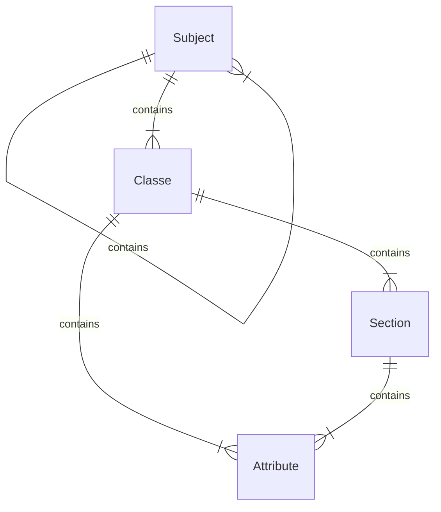
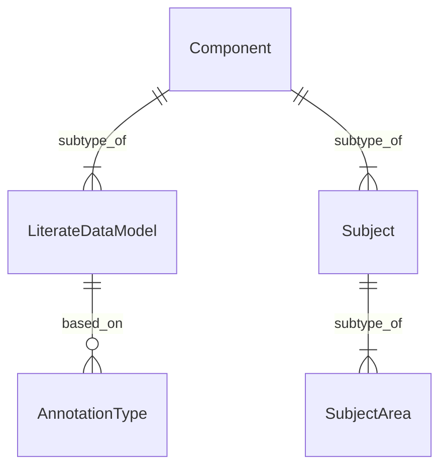

# Mermaid Test

## from diagrams model


# the simple sample


## the full sample
```mermaid
erDiagram
    Component |o--|o LiterateDataModel : inherits
    Component|o--|o Subject : inherits
    Subject |o--|o SubjectArea : inherits
    Component ||--|Class : inherits
    Class ||--|ReferenceType : inherits
    Component ||--|Key : inherits
    Key ||--|UniqueKey : inherits
    Component ||--|AttributeSection : inherits
    Component ||--|Attribute : inherits
    Component ||--|Constraint : inherits
    Constraint ||--|ClassConstraint : inherits
    Constraint ||--|AttributeConstraint : inherits
    Component ||--|Method : inherits
    Component ||--|ParameterAnInputToAMethod : inherits
    AnnotationType }--|| LiterateDataModel : based_on
    Annotation }--|| Component : based_on
    Annotation |o--|o AnnotationType : annotationType
    Subject }--|| LiterateDataModel : based_on
    Subject |o--|o Subject : parentSubject
    Class |o--|o Class : basedOn
    Subtyping }--|| Class : based_on
    CodeValue }--|| CodeType : based_on
    Key }--|| Class : based_on
    AttributeSection }--|| Class : based_on
    Attribute }--|| AttributeSection : based_on
    Attribute |o--|o DataType : dataType
    ClassConstraint }--|| Class : based_on
    AttributeConstraint }--|| Attribute : based_on
    Method |o--|o DataType : returnType
    ParameterAnInputToAMethod |o--|o DataType : type
```